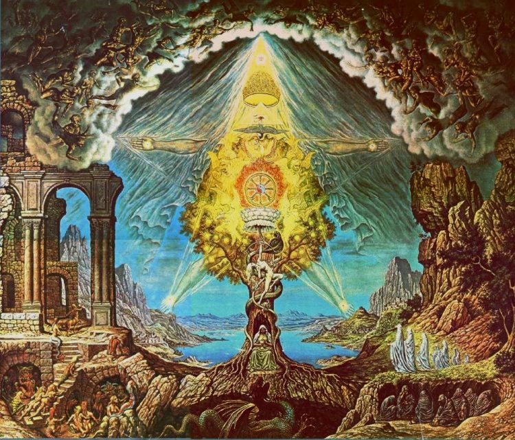
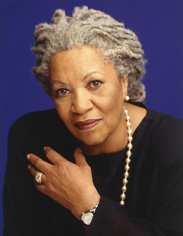
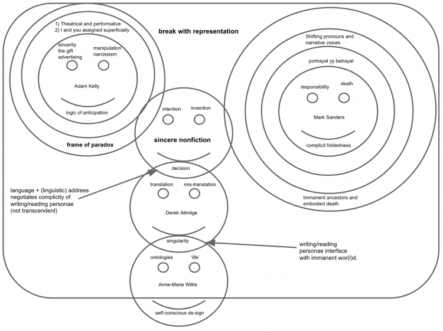

title: Academic Work

description: An overview of a few of the pieces I wrote when studying which might actually be worth returning to at some stage.

# Academic Work

I am sorely tempted to edit and update my work, but have left it as I handed it in so that it is possible to trace the development of my thought across the years. There is a lot of stuff in these essays that I cringe at now, but learning how to love yourself as you are means learning how to love all your selves, especially those that exist only in memory. Perhaps through doing this, and reflecting on the transitory nature of self and thought and personality - looking back on ideas which mattered so much at the time and seeing them from a wider perspective in which they seem mostly trivial - we can come to realise experientially the essential emptiness of self.  

This applies especially to the hubristic, intellectual, academic ego - which thinks it can acquire knowledge endlessly, and that such acquisition will result in higher status, deeper satisfaction and whatever else this particular shadow conjures up in its endless pursuit of **more**.

There is no end to what we can know. There is only one thing worth knowing.  

_Lā ilāha illa'Llāh_.

**Playing With Time: Milton's Satan, Similes, and Subversion**

A Research Essay written in October 2012 at Rhodes University. It details the tragic figure of Satan in the epic poem _Paradise Lost_, the various ways in which he can be read, and what this ultimately reveals about the reader.

[Read More](./playing-with-time)

**A New Community: the Language of Morrison and Mpe**

Despite the above, this essay has been edited extensively. I was insufferable in my fourth year and, though I had some good ideas, I had no means of making sense of them. This revised verion attempts to reinscribe the most ancient and important feature at the heart of any language - that is, the community which gives it meaning.

[Read More](./communal-language)

**Yours Sincerely: Truth, Singularity, and Ontological Designing**

A Master of Studies thesis for Oxford University in the field of World Literatures in English, written in 2014/5. The only thing really worth knowing is the map which reveals how to use language to break with the frame of representation using language always-already implies.

[Read More](./yours-sincerely)

