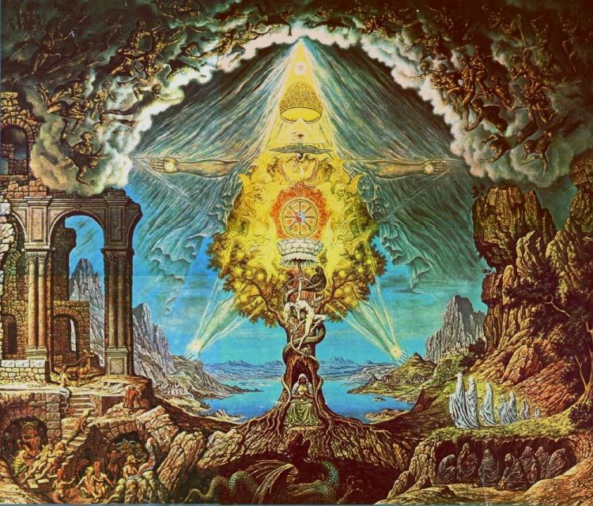

title: Playing With Time - Milton's Satan, Similes and Subversions

description: A Research Essay written in October 2012 at Rhodes University. It details the tragic foigure of Satan in John Milton's epic poem Paradise Lost, the various ways in which he can be read, and what this ultimately reveals about the reader.

# Playing With Time: Milton's Satan, Similes and Subversions

## Section I

One of the enduring mysteries of Milton’s grand epic “Paradise Lost” is the range of criticism, complimentary and otherwise, it has generated over the centuries. The poem has sparked an almost unique reaction in every different generation of readers who have braved Milton’s grand style and mind-twisting grammar.  The obvious example of the same character giving rise to varying interpretations, quite poles apart, is Satan.

For Romantic readers like Blake and Shelley, Satan was Milton’s epic hero (intended or not) hence the claim; “Milton’s Devil as a moral being is far superior to his God” (Shelley, 63). The eminent Victorian critic, Sir Walter Raleigh, contends that “Satan unavoidably reminds us of Prometheus… His very situation as the fearless antagonist of Omnipotence makes him either a fool or a hero and Milton is far from permitting us to think him a fool” (Raleigh, 133). For a modern reader this view has been combated fairly effectively by C.S. Lewis in his A Preface to Paradise Lost, wherein he makes the distinction between believing Satan to be a magnificent poetical achievement worthy of the reader’s admiration and thinking him a magnificent character in and of himself. Satan, for Lewis, “becomes more a Lie than a Liar; a personified self-contradiction” (Lewis, 94)

What is baffling is that two admittedly great literary personages of Lewis and Shelley might arrive at views so incredibly different. Is it possible that Satan was somehow a different character in Blake and Shelley’s time? What is more is that Lewis has by no means won the debate about Satan or the value and greatness of Milton’s poetry with critics of the poem post-1940. A.J. Waldock has this to say:

> There is hardly a great speech of Satan’s that Milton is not at pains to correct, to damp down and neutralize. He will put some glorious thing in Satan’s mouth, then anxious about the effect of it, will pull us gently by the sleeve (for this is what it amounts to) : ‘Do not be carried away by this fellow : he sounds splendid, but take my word for it…’ Has there been much despair in what we have been listening to? The speech would almost seem to be incompatible with that. **Waldock, 77**

We might, at first, be inclined to agree with Waldock if we consider Satan in Book I. He does indeed sound glorious, and Milton does indeed check him just after his speech:

> Irreconcileable, to our grand Foe,  
> Who now triumphs, and in th’ excess of joy  
> Sole reigning holds the Tyranny of Heav’n.  
> So spake the Apostate Angel, though in pain  
> Vaunting aloud, but rackt with deep despair  
> **Book I, ll. 123-6**

Satan here has elements of Milton’s own utterances in Areopagitica, berating censorship of any kind and championing the individual will, virtuous because ‘purified’ by trial. The narrative voice at the end does seem contradictory; where in the preceding speech does Satan show any signs of despair?

There seems to be even more evidence in Waldock’s favour if we consider the debate in Pandæmonium in Book II where each devil is given his say only to be rebuked by the narrative voice after his speech. Moloch “… ended frowning, and his look denounc’d/ Desperate revenge” (Book II, 106-7). Belial, whose words are only “cloath’d in reasons garb/ Counsell’d ignoble ease and peaceful sloth/ Not peace” (Book II, 226-8) is veritably taunted by the narrative voice. Mammon receives great applause, but this is only because, for the devils, “another such Field/ They dreaded worse than Hell: so much the fear/ Of thunder and the Sword of Michael/ Wrought still within them” (Book II, 292-5) and Beelzebub can only “[Plead] his devilish Counsel, first devis’d/ By Satan” (Book II, 379-80) even though “Satan except, none higher sat” (Book II, 300).

These narrative retorts to some of the most grandiloquent political language in the poem (Book II, 164, 185, 199-225, 230-7, 254, 310-2) and perhaps the entire language, do admittedly seem out of place. However, my argument is that the speech does not “seem” (Waldock, 77) to be incompatible with the narrative rebuke at the end of it; it very much is incompatible with it. Moreover, Milton isn’t pulling “us gently by the sleeve” (Waldock, 77); he is doing exactly what I have suggested – rebuking us. It is the equivalent of a literary slap in the face. Milton is not politely warning us, but accusing, taunting us with an imperious narrative voice which says “I know that you have already been carried away by what has been said. I knew you would be, even though you should not have been. You have made a mistake because you are fallen.”

The invitation is to recognise your fallen nature because this will lead you to a full understanding of Milton’s message at the end of the poem; although fallen, there is nevertheless the possibility of “A paradise within thee, happier farr” (Book XII, 587). Waldock’s insistence that the epic voice and preceding speech “must agree” (Waldock, 78), stems from a modern preference for showing over telling, illustrated by Wayne C. Booth. This preference is particularly out of place in the epic genre, as this necessarily requires the guiding persona of the poet and his epic voice.

The complexity of the devils’ speeches is only apparent when the reader has been led to discovering them by the necessity of having to account for the difference between reading experience and what Milton’s narrative voice is saying. On noticing such complexity, it’s obvious that Milton isn’t correcting a mistake of his own composition, but is pointing to the weakness all men tend to show in the face of demonic eloquence. Waldock is wrong to think that the narrative rebuke somehow scrubs our minds of Satan’s or the devils’ “glorious utterances, heroic demeanour and impressive wilfulness” (Raleigh, 5). In actuality, it sets up a dramatic conflict between the immediate context of what is being said and the larger, cosmic context of the epic situation. It is a conflict analogous to the difference between Satan’s inner despair and outer vainglorious, boastful and arrogant demeanour.

However, if we consider this closely, the analogy is inverted, as it is Satan’s inner state which correlates to the larger, cosmic context that Milton was working in. This is not surprising, given Milton’s constant reminders of Hell (and Paradise, as above) as not just physically realisable places, but psychological states of being:

> The Hell within him, for within him Hell  
> He brings, and round about him, nor from Hell  
> One step no more than from himself can fly   
> By change of place  
> **Book IV, ll. 18-23**

It is at this point that Milton begins to “play” with the reader. I do not mean this in the sense of a child on a playground, but rather in that age-old dictum Milton would have known all too well; docere et delectare. Milton’s poem suggests that our internal state is related to the cosmos, which we can alter according to our free will and through our relationships with others, although God has foreknowledge of all futures and essentially exerts his authority through his mere existence. This is a point I feel Waldock misses entirely; one of Milton’s major concerns is with relationships; how we relate to God, the Son and the Angels (both as fallen and unfallen beings), how we relate to Satan and him to us, how Satan relates to God, how Satan relates to himself, how we relate to Adam and Eve and how the way that they relate to each other sheds light on human relationships in general. It is these relationships Milton uses to delight and teach the reader as he is drawn along by the poet’s unique grammar and epic, grand style.

Waldock does not see that these relationships shed light on some of the vital and most engaging speeches in the poem, such as Eve and Adam to each other (Book IX, 205-25, 227-69) and Satan to Eve (Book IX, 679-732). In fact, he misses completely the central relationship Milton is concerned with; that of the poem with the reader. I would argue that the poem’s centre of reference is the reader, as it is to the reader that Milton wants to “justify the wayes of God” (Book I, 26). More than this though, Paradise Lost is written for “the honor and instruction of [Milton’s] country… [For the] adorning of [his] native tongue… [and] to be an interpreter and relater of the best and sagest things among mine own citizens” (Milton, ‘The Reason of Church Government’, emphasis added). In other words, Milton has a specific purpose in writing his epic; he wants to educate his reader into a knowledge and then acceptance of their position and responsibilities as a fallen being. Milton achieves this by recreating the effects of the Fall in the mind of each reader, which is arguably the poem’s final ‘scene’. We must believe Satan entirely if we are to learn how to see through his lies. If we did not see them as true first (or as holding some truth), we could not realise, and thus overcome, the power of Satanic eloquence; precisely the reason for Eve’s fall – her being “mindless” (Book IX, 431).

The poem’s relationship with the reader goes deeper than this though, for we often forget that the Seventeenth Century reader was a very different man to the modern one. Milton, fortunately, lived on the edge of Douglas Bush’s “scientific movement” (Bush, 37) which divorced cosmic principles from human relationships and interaction. This shattered what E.M.W. Tillyard describes as the “Chain of Being” (Tillyard, 37); an object that was thought to both distinguish and unite all modes of existence from rocks, through plants and animals, to humans, angels and God. As such, Milton could make the most of the “medieval allegorical instinct”, which Bush describes as arising from “the simultaneous embracing of different planes of knowledge and experience or the habit of immediate and almost unconscious transition from one to another” (Bush, 38). The transition from Satan’s voice to narrative rebuke is perhaps the most prominent example of Milton mixing different cosmic planes of knowledge and experience to induce a specific effect (that of the recognition of one’s own fallen nature) in order to achieve a specific purpose (educate the reader so that he can regain a paradise within himself).

## Section II

The characters of Satan and the devils may be the most widely discussed and criticised of Milton’s attempts to educate the reader while writing a national epic, but they are not his only mechanism. Epic simile is an important part of the epic genre, used specifically in an attempt to place people and things, perceived in one time and place, in the larger perspective from which their significance can be determined. This presents an obvious problem for Milton though, for the story he is telling is not one that exists fully in time and space. We cannot think of God or of the story of creation as happening at a given time or place, as both of these notions are premised on the act of creation itself. Milton’s similes may therefore be seen as a solution to an apparently unsolvable problem; by refusing to allow the reader to perceive a firm notion of time and space initially, Milton can widen the scope of the poem to include the entire cosmos without contradicting himself. Let us consider one of the first epic similes we encounter in the poem:

> His Spear, to equal which the tallest Pine  
> Hewn on Norwegian hills, to be the Mast  
> Of some great Admiral, were but a wand  
> **Book I, ll. 292-4**

If re-read slowly, this does make sense; and we can construct a statement of relative magnitudes; “Spear is to pine as pine is to wand”, but this is not what the reading experience is truly like. Due to Milton’s grammar, this experience tells us is that were one to compare his spear to a pine, the comparison would be inadequate. Milton is mixing scales; if he allowed the association with the pine to stand it would have been inadequate, as Satan is a higher dimensional being, and so his ‘size’ cannot be understood in human terms. If he had merely said that the spear is larger than one can imagine, he would have lost the concreteness that is vital to any effective image. We cannot simultaneously imagine a pine and a wand while comparing both to a third object, and so Milton is able to suggest a reality beyond our own by forcing the reader, dramatically, to feel its unavailability.

Within lines of this, Milton produces what is arguably the finest epic simile in English literature:

> His Legions, Angel Forms, who lay intrans’t  
> Thick as Autumnal Leaves that strow the Brooks  
> In Vallombrosa…                                                           
> **Book I, ll. 299-301**

Milton moves from “Angel Forms” to leaves to sedge to “Busiris and his Memphian Chivalry” (Book I, 307). The compression of images here is so densely intermingled with different time frames that it almost defies analysis. The fallen angels (who are like Pharaoh and his cavalry in that they are in a lake, beaten by God) are as numberless as autumnal leaves and are scattered (like Pharaoh) as easily as sedge. Both are already pursuing “The Sojourners of Goshen” (Book I, 309) which can be taken to mean, quite literally, the Israelites – as well as Adam and Eve – and hence, by Milton’s interconnected world, the reader. Attempting to unravel a chronological time frame proves impossible; Milton has moved from outside conceptions of time, to recorded human history to the reader’s present and back again in 12 lines of poetry. Furthermore, we are made to feel the shifts inessential, carried along by words like “Vallombrosa”, which stress the image above all else. Conceptions of time are shattered by Milton’s style, grammar and palpably aural techniques. One need just roll “Vallombrosa” on the tongue to be transported to a paradise where time is truly of no concern.

Between these two similes, we find one of Milton’s many references to the “Tuscan Artist” (Book I, 288) Galileo Galilei, whose “glazed optic tube” (Book III, 590) could well represent the limits of human knowledge in Milton’s time. However, even the references to astronomers bear great ambiguity. Adam asks Raphael for an explanation of planetary movement in Book VIII, and is replied to thus:

> … how gird the Sphear  
> With Centric and Eccentric scribl’d o’re,  
> Cycle and Epicycle, Orb in Orb  
> **Book VIII, ll. 82-4**

> The Planet Earth, so stedfast though she seem,  
> Insensibly three different Motions move?  
> **Book VIII, ll. 129-30**

The greatest shock for a modern reader, besides the fact that Milton is mixing two theories about space, is that the speech is finished off with another narrative intrusion: “To whom thus Adam cleerd of doubt, repli’d” (Book VIII, 179). Cleared of doubt? This seems dubious at best. How is it possible that such a convoluted explanation which mixes two clearly different world-views clears Adam of doubt? What is more is that Milton actually anticipates this reaction in the argument to Book VIII; “Adam enquires concerning celestial Motions, is doubtfully answered”. One answer to this question has already been hinted at in the discussion of Satan above. Only by forcing upon the reader an awareness of his limited perspective can Milton provide a negative intuition of what another perspective may be like. The reasoning may seem circular, but this is a direct consequence of the poem’s subject matter; it is the story of creation and, as such, still creates the responses of its reader and (for Milton) all readers.

The fact is that Adam is cleared of doubt only because he is unfallen and thus knows that the knowledge offered to him by Rafael is all that he needs to know; other things remain rightly out of reach of his understanding as a man. By making sure we doubt where Adam does not, Milton makes us aware of the gap between ourselves and Adam. We are made to feel palpably the result of the Fall by the clearly outrageous comment of the narrative voice which is just as clearly true. If we can find our way through this juxtaposition, we can come to fully appreciate Adam’s words in Book XII:

> Greatly instructed I shall hence depart,  
> Greatly in peace of thought, and have my fill  
> Of knowledge, what this vessel can containe.  
> **Book XII, ll. 557-90**

Milton seems to suggest that there is some knowledge that cannot be contained in earthly vessels, which are bound, by their very nature, to earthly dimensions.

## Section III

Such dimensions include time, which has always been a topic of much debate for scientists and philosophers. Milton unsettles the reading experience with truly epic shifts in time. The most obvious of these is Michael taking Adam on a run through of most of human history in Books XI and XII. However, we are met with discrepancies in time much earlier on, in fact, as early as the first page. We are told that “Nine times the Space that measures Day and Night” (Book I, 50) is the distance Satan fell from heaven. While this may be taken from Greek myth, the ambiguity about quite what or who is doing the measuring is clearly Miltonic.

Can space measure? If so, how long is a day and is it longer or shorter than a night? Can day and night be spatial at all? Milton, in many ways, was a couple of hundred years ahead of Einstein, for this is surely analogous to the spacetime of Einstein’s General Relativity. Einstein linked space and time through hyperbolic, four dimensional geometry in Minkowski spacetime. Milton’s relativity is, in many ways, far easier to understand than Einstein’s and has one major advantage over it. Milton’s relativity relates all things under the static Chain of Being, which can nevertheless be traversed by the use of free will to move higher up or further down relative to the absolute of God (Tillyard, 45). This fact alone allows Milton to extrapolate relationships between every one of his epic characters and the reader and draw at least some conclusions, through the use of his epic voice, not available to Einstein. One might say Milton’s is a vertical relativity bounded by God while Einstein’s is horizontal and exists only in the limit of human knowledge.  

Consider the start of Book IX; we begin in an indeterminate time where Milton tells us he “must change/ Those Notes to Tragic” (Book IX, 6) and justifies why. We then find we are back with Satan (Book IX, 53), circling the Earth “From Pole to Pole” (Book IX, 66). We are also back to the end of Book IV, where we left Satan for Raphael and Adam’s visit which lasts the better part of four books. Milton then posits his explanation for our inability to understand God and his Angels in entirely human terms; “There was a place,/ Now not, though Sin, not Time, first wraught the change” (Book IX, 69-70). Note how ‘Time’, sandwiched in between two caesuras, breaks the flow of the sentence and hence disrupts our understanding of what Milton is saying as we read. Milton is again using his grammar to both play with the reader as well as make a serious point about how our concept of linear, chronological time hampers our understanding of things which necessarily exist outside of conceptual experience. By placing ‘Sin’ before ‘Time’ he also makes the reader painfully aware of the very human cause (and thus nature) of this problem.

Milton is continually turning the reading experience back on the reader; teaching him while delighting him through an almost numberless array of structural, grammatical, stylistic inversions and twists. These force the reader to acknowledge his fallen nature while making sure that he too comes to the same conclusion as Milton does; there is indeed the possibility of “A paradise within thee, happier farr” (Book XII, 587) to be reached by faith in the redeeming power of the Son. Milton’s epic voice is perhaps more prevalent and demanding than other epic voices, but this should be seen as a result of the specific purpose Milton had in writing a national epic.

He never allows the reader to settle in a time or place or to think about extra-dimensional beings in only one way, or through only one image. His use of contradictory images and systems (which are still fundamentally related in the cosmic background of the work) to illustrate and place his poem in time and space, serve to make the scale and scope truly infinite by refusing to fix any one point in absolute relation to any other. As soon as we believe Belial, we are rebuked into remembering that his words are only “… cloath’d in reasons garb”; as soon as we think we can picture Satan, we are told that what we had in mind is “but a wand” (Book I, 294) to the actual reality of the “Apostate Angel” (Book I, 125). The fallen angels as “Autumnal Leaves” (Book I, 299-311) is probably the most famous example of the sort of intermingled notions of myth, knowledge, time, place and space that constitutes the Miltonic world. Milton, in all his brilliance, is able to structure his very language and form so that any comment on the poem is, through the fundamental relationship of poem to reader, equally a comment on the reader himself.

## Works Cited

Booth, Wayne C. _The Rhetoric of Fiction_. Chicago. Penguin Books, 1961.

Bush, Douglas. _The Earlier Seventeenth Century_. Oxford. Oxford University Press. From Dept. English RU Handout, pg. 4-5.

Forsyth, Mark. The Etymologicon. London. Icon Books Ltd. 2011 (page 15)

Keats, John. “Ode on a Grecian Urn”. 5 verses. @ 13 October2012. <http://englishhistory.net/keats/poetry/odeonagrecianurn.html>

Lewis, Clive Staples. _A Preface to Paradise Lost_. Oxford.  Oxford University Press, 1942.

Milton, John. _Areopagitica_. Dept. English RU Handout, pg. 7.

Milton, John. “The Reason of Church Government”. Dept. English RU Handout, pg. 6.

Milton, John. _Paradise Lost_, ed. Barbara Lewalski. Oxford. Blackwell Publishing, 2007. (Written 1674)

Raleigh, Sir Walter. _Milton_. London. Oxford University Press, 1915. (p. 133)

Shelley, Percy Bysshe. “On the Devil, and Devils” in Paradise Lost: A Casebook ed. A. E. Dyson and Julian Lovelock. London. The MacMillan Press Ltd, 1973.

Tillyard, E.M.W. _The Elizabethan World Picture_. London. Peregrine Books, 1963. (Written 1943)

Waldock, A.J. _Paradise Lost and its Critics_. Cambridge. Oxford University Press, 1961 (Written 1947).

### Other Reading

Eliot, T.S. “Milton: Style and Tradition (1936 and 1947) in Paradise Lost: A Casebook ed. A. E. Dyson and Julian Lovelock. London. The MacMillan Press Ltd, 1973.

Hughes, Merritt Y. _John Milton: Complete Poems and Major Prose_. New York. The Odyssey Press, 1957. (Introduction as English Dept. RU Handout booklet)

Rajan, Balanchandra. “The Problem of Satan” in Paradise Lost: A Casebook ed. A. E. Dyson and Julian Lovelock. London. The MacMillan Press Ltd, 1973.

Tillyard, E.M.W “The Crisis of Paradise Lost” (1951) in Paradise Lost: A Casebook ed. A. E. Dyson and Julian Lovelock. London. The MacMillan Press Ltd, 1973.

Tillyard, E.M.W. _Milton_. London. Peregrine Books, 1968. (Written 1930).