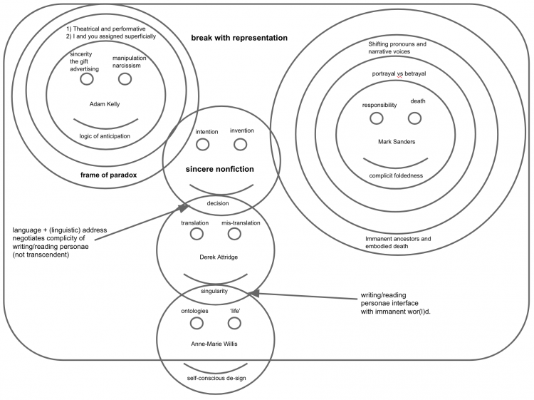

title: Yours Sincerely - truth, singularity, and ontological designing in white South African nonfiction

description: A Master of Studies thesis for Oxford University in the field of World Literatures in English, written in 2014/5. 

# Yours Sincerely: truth, singularity, and ontological designing in white South African nonfiction  

Supervisor: Dr Michelle Kelly  
The University of Oxford  
Mst World Literature in English  
June 2015  
Words: 11026

“_I walked my love_  
_on the night green side of it and cried_  
_my heart to the eastbound cars and cried_  
_my heart to the westbound cars and took_  
_my truth across a small humped bridge_  
_and hurried my truth, the charm of it, home_  
_and hoarded these constants into morning_  
_only to find them gone._”  
  
— **Just Once**, Anne Sexton  

## Setting the Stage

> “One must begin by recognizing the lack of any transcendent, absolute, Archimedean point from which to judge the authentic from the inauthentic, the sincere from the manipulative, truth from ideology” (Adam Kelly, “New Sincerity”, 2010: 137-8)

“Here is truth telling at its most courageous and exemplary” claims the front-cover of My Traitor’s Heart (Vintage, 1990). However, if – as Kelly claims – one can never tell the sincere from the manipulative, then are ways of writing which are advertised as the ‘truth’ to be read sincerely or suspiciously? If there is no way of separating ‘truth’ from the performance of truth, then what warrants the description ‘exemplary and courageous’ and why do critics like Hedley Twidle emphasise the “current success of nonfiction in South Africa” (“In a Place”, 2012: 6)? Nonfiction makes its primary truth-claims via marketing which places it in a specific, verifiable ‘reality’. As Salman Rushdie says in his short introductory note:

> “The book Rian Malan set out to write is altogether more conventional than the one he has written […] along the way, he ran into, and faced up to, the truth that is the making of his book […] that he could only write about the atrocity of South Africa by admitting the atrocity hidden in his own traitorous heart.”

In other words, though nonfiction is advertised as being about ‘reality’, one can only express the ‘truth’ by performing one’s own role in creating that ‘truth’. The ‘reality’ of nonfiction is revealed by showing how the ‘truth’ depends on the reader’s belief in such admissions of treachery and their awareness of the way ‘reality’ is inevitably manipulated in order to represent unconventional and traitorous – yet affective and self-conscious – ‘truths’.

David Shields argues that the desire to break “larger and larger chunks of ‘reality’” into artistic works is, in fact, common to “a burgeoning group of interrelated but unconnected artists in a multitude of forms and media” (Reality Hunger, 2010: 3). Shields claims this ‘reality hunger’ to be present in almost any artistic movement, arguing that modern readers are both “desperate for authenticity and in love with artifice, they know all the moments are ‘moments’: staged and theatrical, shaped and thematized” (5). Importantly, Shields’ “antigenre […] relies on viewer awareness of the creator’s self-conscious, wobbly manipulation of the gap between person and persona” (4). My focus in this essay will therefore be on the ways in which the gaps between person and persona and ‘truth’ and its performance are manipulated, as well as how – even as performances – such manipulative moments might be read sincerely so as to grasp at “something more than truthfulness” (Midlands, 2002: x), something describable only in terms of Derek Attridge’s concept of “Singularity” (2014).

Rian Malan’s _My Traitor’s Heart_, Antjie Krog’s _Country of My Skull_ (1998), and Jonny Steinberg’s _The Number_ (2004) all rely on similar kinds of self-conscious address and manipulation, beginning with Malan’s very first words: ““I’m burned out and starving to death, so I’m just going to lay this all on you and trust that you’re a visionary reader” (Heart, 13). Each work exhibits what Shields calls “plasticity of form” (Reality, 5), moving between narrative voices and different modes of address to reveal a deep concern with the acts of interpretation, translation, speaking, and listening between black and white, English and Afrikaans, Afrikaans and Zulu, and so on. Self-conscious, if wobbly, manipulation of the gap between person and persona relies on what Adam Kelly calls a “logic of anticipation” (“Sincerity”, 136). He explains that “the anticipation of others’ reception of one’s outward behaviour […] begins to take priority for the acting self, so that inner states lose their originating causal status and instead become effects of that anticipatory logic” (136).

In other words, how we expect others to react becomes the originating cause of how we present ourselves, which can be read either as deeply narcissistic, or as a sincere attempt to engender a different kind of responsibility. It all depends on what the reader chooses to make of the performance. Kelly describes anticipation as that which morphs “divisions between self and other […] into conflicts with the self, and a recursive and paranoid cycle of endless anticipation begins, putting in doubt the very referents […] ‘self’ and ‘other’, ‘inner’ and outer’” (“Sincerity”, 136).

Steinberg’s work, grounded as it is in his methods of ethnographic research, seems most concerned with conflicts between the self and how these relate to an external world shared with others. He returns time and again to the problems of narrating anyone’s story but one’s own:

> I shut up. The subject had dusted off his most eloquent words and shut the ‘I’ up. But he had, of course, told the ‘I’ precisely what every ‘I’ wants to hear. He had assuaged my bad conscience, had given me licence to scorch his heart and open his soul. The victory was mine, not his, and it left me feeling no less anxious than before. (The Number, 242)

Each sentence adapts the claims of the last, and the shifts from I to ‘I’, to he and ‘I’, to he and me, clearly stage the ways in which it is possible to manipulate the gap between person and persona, which Shields claims to be a definitive feature of reality hungry art. Steinberg seems well aware that for a white man to declare he can write a story concerned with the lived experiences of ‘South Africans’ in general is highly suspicious: “I am forced by the colour of my skin to employ others as my eyes and ears, and I am therefore prone to all the failures of my predecessors. I announce up front that I will not tell you how the material was gathered” (Midlands, 2002: 218). Given that the last sentence takes the form of an announcement, this too can be read as fundamentally performative, but it is a performance which Steinberg insists is based upon research and various ‘gathered materials’.

If we lay aside for a moment the “hermeneutics of suspicion” (“Sincerity”, 140) which Kelly argues gloss over the “truly valuable in human life […] love, trust, faith and responsibility” (135), is it not possible to make performances like this ‘true’ in so far as the reader believes in them, knowing the writer to be as ‘anxious’ about such an extension of trust as they are? Furthermore, the fact that Steinberg is designing texts in which the ‘colour of his skin’, the ‘failure of his predecessors’ and the fact that he deliberately withholds information, paradoxically, seems to add to the truth-value of the work, means the question becomes not just one of reading sincerely and believing the performance, but how we might actively design the ways we read and write to include ‘the truly valuable in human life’, rather than hoping for Malan’s ‘visionary reader’ and reading suspiciously.

‘Love, trust, faith and responsibility’ seems to be most affectively expressed in the self-conscious manipulation of the gap between person and persona, yet there remains something deeply artificial, something staged, about the ways in which all three writers are able to interact with and interpret the “irreconcilable realities”, or “separate psychic trenches” (Heart, 412) of South Africa and her people. However, as Shields argues, ‘reality hungry’ art negotiates paradoxes like this with elements including: “artistic risk, emotional intensity and urgency, reader/viewer participation; [and] an overly literal tone, as if a reporter were viewing a strange culture” (5).

When Steinberg announces “up front that I will not tell you how the material was gathered” (Midlands, 218), this is both to take a big artistic risk, and to engage actively in a dialogue with you, the reader, in something approaching an ‘overly literal tone’. Moreover, ‘I’ and ‘you’ are not stable within any of the texts I have chosen, so while the marketing of a work as ‘nonfiction’ sets up a supposedly simple textual relationship of I=writer and you=reader, the shifting nature of the pronouns within the actual text complicates greatly each telling. All three writers are addressed as ‘you’ at various different stages by both fictional characters (like Professor Kondlo) and ‘real’ people like Magadien: “I am telling you. I need to be Magadien Wentzel to live a proper life” (The Number, 31) or Creina Alcock: “the only thing you can do is love” (Heart, 409), which is to collapse both writer and reader into the second person.

As Phillip Lopate notes, “the solution to entrapment in the narcissistic hothouse of self is not to relinquish autobiographical writing, but to expand the self by bringing one’s curiosity to interface with more and more history and the present world” (To Show and Tell, 2013: 10-11). Broadly speaking, autobiography has to do with narratives concerned primarily with the self, told by the self; whereas nonfiction – in my terms – has to do with narratives primarily about a wider, shared ‘reality’ told by a self as an act of collaboration with that ‘reality’ and the people, objects, and practices of which it is constituted. Steinberg’s work is, again, exemplary in terms of the kinds of collaboration it allows for – not only between writer, characters (who are also interpreters, translators and contributors) and readers – but also between the persona ‘Jonny Steinberg’ and various well-known South African intellectuals and institutions, from Ivan Vladislavić to the Centre for the Study of Violence and Reconciliation, who funded his research for The Number (2004: ix). In a very ‘real’ and open way, Steinberg designs textual spaces which de-sign him back, so that it is not only about reading sincerely, but creating works (as both writers and readers) in which the hermeneutics of suspicion ought to be laid aside in order to express ‘something more than truthfulness’, something with the same ineffable structure of Attridge’s ‘singularity’.

Anne-Marie Willis concept of “ontological designing” acknowledges that, while we design our spaces (and here she means literally any self-consciously designed space, be it structural, material, textual or otherwise), “in turn we are designed by our designing and by that which we have designed” (“Ontological Designing”, 2006: 80). Therefore, the fact that Malan, Krog, and Steinberg all worked as reporters plays an integral role in the nature and quality of each of their texts. Rian Malan, descended from the first Dutch settlers themselves, worked for a time on “the crime beat” (Heart, 35), which obliterated his “certainties” (330) and drove him into exile rather than carry arms for the apartheid government. His fractured experience resulted in an ironic book written and published in English by Vintage, “which tells us of the defeat of its authors illusions, his ideals, his sense of courage, his ability to comprehend his fellow South Africans as they danced their death dances” (Salman Rushdie, Introductory Note). Antjie Krog, also Afrikaans, worked as a reporter at the Truth and Reconciliation Commission, leading to the skin-scorching Country of My Skull, which she actually wrote in Afrikaans first, although published it in English for reasons I will deal with later.

Jonny Steinberg, all of whose books are written and published in English, also worked as a reporter and columnist (some of which is collected into Notes From a Fractured Country (2007)) for a number of publications. Just like Malan before him, he often ventures into some of the most dangerous and dilapidated parts of the country. Rather than irony though, the way he collaborates with both characters and ‘real’ people – who are often impossible to distinguish on account of him being open about the fact that he regularly changes names to protect or respect people – means that uncertainty and a certain kind of fracturing becomes a structural feature of his work. Writing in Afrikaans and publishing in English, or inserting passages which assess the role of the writing ‘I’, or passages in which writer and reader are collapsed in the second-person address of a character, suggests that the works I have chosen have primarily to do with different kinds of fracture and breaks with representation to get at an ultimately performative array of “turth or trth” (Country, 54). This ‘truth’, which Krog shows she cannot even type, is unique to each individual, time and experience (apartheid, TRC, postapartheid) and yet also shared in some fundamental, “folded”, and common experience of what Mark Sanders calls “human-being” (Complicities, 2002: 89).

However, unlike hard news reports, South African nonfiction seems exemplary in that it is not ‘desperate’ for what Shields calls “authenticity” (Reality, 5). As Antjie Krog writes:

> if you believe your own lie – because as narrators we all give ourselves permission to believe our own versions – how can it be said that you are being misleading? To what extent can you bring yourself not to know what you know? Eventually it is not the lie that matters, but the mechanism in yourself that allows you to accept distortions. (Country, 133)

The use of shifting pronouns is clear here: the second-person address implicates the reader, then the parentheses works to include that reader in a wider circle of narrators, all of whom lie and mislead and accept that their ‘truths’ will always be in some way distorted. Nonfiction, in Krog’s view, is doomed always to manipulate its ‘trth’ and so is concerned not with authenticity, but with sincerity; with the ability to believe your own lies and thereby perform the ‘truth’ – both while writing, as well as while interpreting/reading/translating that ‘truth’. Lionel Trilling defined sincerity as “a congruence of avowal and actual feeling” (Sincerity and Authenticity, 2), going on to point out that it has been “a salient, perhaps a definitive, characteristic of Western culture for some four hundred years”(6). Most importantly, sincerity retains a notion of the “performative, [of its] theatrical origins” (9).

David Shields argues that, inundated by such performances, modern readers have become more skeptical than ever “of the desperation of the modernist embrace of art as the only solution, and hyperaware of all artifices of genre and form, [yet] we nevertheless seek new means of creating the real” (24). In order to ‘create the real’ in a believable fashion, Adam Kelly argues that we need to do away with “the ideal of authenticity, which conceives truth to the self as an end”, and return to Trilling’s (and Shakespeare’s) formulation of sincerity as an ideal involving “truth to the self [… only] as a means of ensuring truth to the other” (“Sincerity”, 132). He goes on:

> sincerity places emphasis on intersubjective truth and communication with others, and [with] what Trilling calls the ‘public end in view’, authenticity conceives truth as something inward, personal, and hidden, the goal primarily of self-expression rather than other-directed communication. (132)

In other words, the kinds of ‘truth’ sincere nonfiction can express are primarily dialogic and affective. Essentially, Kelly is suggesting that we do not need new means of creating the real, merely old ones that have been reinterpreted within a world inundated by other-directed communication. The question becomes one of creating the ‘real’ in believable ways, which is something Malan, Krog, and Steinberg achieve via different techniques, though I will argue that the collaborative and anticipatory frames within which Steinberg conducts his research and writing are exemplary of a new kind of “Ontological Designing” (Anne-Marie Willis, 2006) beginning to take form in the apparent formlessness of Shields’ “antigenre” (Reality, 4).

---

Put differently, sincere writing which anticipates its own ability to manipulate, or marketing that discusses its own narcissism, or ‘reality’ that shows up its own artifice, are all made meaningful only via a collaborative, dialogic, and informative performance of the ‘truth’ they are advertised to represent. Antjie Krog insists that she writes “fiction bordering on fact but marketing it as nonfiction” (“I, me, me, mine!”, 2005: 106) which is to make a distinction that, as Kelly notes of advertising in general, “highlights the complexity and impurity of all discourse,” that can “only be responded to by acknowledging one’s own implication in [Derrida’s] ‘general system of writing’” (“Sincerity”, 139). In that the logic of anticipation – or the self-conscious manipulation between person and persona – relies on a response to the other before they have even reacted, performing sincerely and believably requires an assertion of responsibility for one’s audience(s). However, just as “true sincerity, if there ever is such a thing, must take place in the aporia between the conditional and the unconditional” (140), true responsibility – as Mark Sanders notes – would only be possible before a “more or less transcendental figure of alterity” (Complicities, 2002: 98), which is none other than the aporia of death: “Sizwe looked into Jake’s dying face and saw himself. For a moment in that room, the boundaries between the two men dissolved” (Three Letter Plague, 30). Negotiating the inability to be responsible before anything but death, which is the only thing that ‘truly’ dissolves boundaries like the one between Sizwe and Jake (or Sizwe and Steinberg), requires asserting complicity in Sanders’ framework: a certain kind of “foldedness in human-being” (98).

Human-being, the category from which Simon Mpungose is excluded in My Traitor’s Heart (212), does not refer only to the human beings we interact with daily, but the “total existential situation of being human in the world” (Complicities, 89); of responding in a singular and idiosyncratic way to the shared experience of ‘reality’. Importantly though, human-being is not a transcendental point from which to judge truth from ideology; it is rather a “self-conscious placing of the self” (91) within a wider space of reciprocal, translating/translated address. Fact and fiction may be impossible to separate in work like Malan’s, Krog’s, and Steinberg’s, but if we lay aside the hermeneutics of suspicion for a moment and interpret and translate their words and works sincerely, new possibilities are created for the expression of the ‘the truly valuable in human life’, thereby turning narratives primarily about the self (autobiography) into wider narratives about a more generally applicable and historically recognisable ‘truth’ (nonfiction).

## Rian Malan and Linguistic Address

> “We tell stories not to die of life” (Country of My Skull, 72)

My Traitor’s Heart begins with a direct plea from the “burned out and starving” writer to the “visionary reader” (13). However, Malan often steps away from his narrative and ‘listens’ to the testimonies and narratives of people like Simon Mpungose (181-205) and Creina Alcock (342-425), becoming the you that they address (409). Adam Kelly argues that any decision regarding the writer’s intention within an anticipatory framework can “only be made by a particular kind of listener” (“Sincerity”, 141) and I think that Malan’s use of multiple narrative voices is intended to force both himself and the reader to listen closely to what is being said and who is saying it. By the end of the narrative, the writer admits that “I’m so deeply enmeshed in half-truths and fictionalizations of myself that I will never escape until I simply tell the truth. This was not the book I was contracted to write” (410). Fact and fiction are presented as essentially continuous here, and the possibility of ‘simply telling the truth’ after four hundred and ten pages seems as likely to happen as the expression of true sincerity or responsibility. The wobbly manipulation of person and persona, of the I-who-writes and the I-who-was-contracted-to-write, can be read either as a kind of egoism and self-aggrandisement, or (if such egoism is read as already-anticipated) as a sincere plea to have the reader believe that his desire to ‘simply tell the truth’ is the real truth – not facts, not fiction, but the desire to speak your ‘truth’ and be heard.

In other words, the believable performance of the ‘truth’ requires both readers and writers to lay aside the hermeneutics of suspicion and find a way back to ‘the truly valuable in human life’, together. Emile Benveniste explains that “I use I only when I am speaking to someone who will be a you in my address. It is this condition of dialogue that is constitutive of person, for it implies that reciprocally I becomes you in the address of the one who in turn designates himself as I” (Problems in General Linguistics, 1971: 224-5). Again, the marketing of a work as ‘nonfiction’ sets up a supposedly simple textual relationship of I=writer and you=reader, though the shifting nature of the pronouns within the actual text complicates greatly each telling. I and you shift, as Benveniste later says, between “a set of empty signs […] which are filled as the speaker adopts them” (286):

>‘[…] I have noticed there is no fairness on this earth. So, I must die, so that what I dreamed in 1972 be fulfilled.

> ‘That is all I wish to say’

> Ah, Simon, Simon, in spite of all I know about you, your words still break my heart. Simon was a killer, and yet, as a friend of mine pointed out, his story seemed to unfold like the story of a saint, deeply disturbing in its biblical parallels […]

> I heard no hatred or despair in his last words, just clarity, which he seemed to be offering as a man offers a gift – a gift of understanding, I thought, and a warning […]

> As it turned out, I presumed a great deal. (Heart, 204-5)

Here, the I starts off as Simon, as he was heard speaking in court, then it shifts to the writer, who addresses Simon directly (in the present tense), and then the I shifts again to a more personal meditation (presumably Malan’s own, in the past tense). Simon is presented in this passage as both a psychopathic killer and a saint, sent to save his people with a hammer and a dream. Neither interpretation is quite right, but nor is either one entirely wrong. Both are unsettled by the shifts in person and tense.

Simon’s story, which takes up a large part of the total narrative, begins with near fairy-tale like narration: “Now comes another tale of ordinary life and extraordinary death in my country. Take my hand, and let’s fly like gods to where it happened” (181) and he is introduced first through the eyes of Debbie Good, one of his victims. The I-who-writes ventriloquises her experience of waking up with Simon in her room, using second person narration to chilling effect:

> You never know when, but you know it’s coming. And then one night you go to bed around ten. You hear the old red setter barking outside […] All you remember is the split second of terror when you wake up […] drenched in blood […] You’re trying to phone the doctor but you can’t remember how to dial. (186)

Carrol Clarkson discusses how you, as addressee of a literary work, gains another dimension when a persona within the world of the novel is addressed as ‘you’:

> the use of persona address has the unnerving effect of placing the reader simultaneously in the grammatical position of the second and third persons, at once present and absent with respect to a double-directedness and mutually exclusive trajectory of address. (Coetzee’s Countervoices, 2009: 61)

Reader and writer slip between the shifting pronouns, but this is exactly what Malan intends, for to have a fixed concept of the reader is, as Clarkson argues, “to ignore the capacity for the invention and freedom of the artwork’s transcendence in the pure potentiality of ‘You’” (61).

The ‘pure potentiality of you’ is what makes sincerity a two-way phenomenon – each reader or listener is forced into making a singular and idiosyncratic decision about the intention of dialogic and/or affective modes of address given that the book is advertised as the ‘truth’. In the context of such ‘truth’, what is particularly interesting in My Traitor’s Heart is that it is not just Debbie Good’s eyes, but her race, which is ventriloquised: “to understand such things, you must see them in the context of the state of elemental guilt and fear in which white South Africans live” (189). You, the reader of an English book, published internationally – but written by an Afrikaner with “a sickness of the soul” (412) – can only understand such things if you attempt to see from the perspective of Debbie Good (all the while noting how this perspective alters and manipulates Simon’s story). When reader, writer and characters start to slip between these shifting you’s, she’s, and I’s in nonfiction specifically, then it is perhaps not quite ‘pure potentiality’ we should speak of, but a limited potential to experience the ‘truth’ as it applies to more than just one’s self: though Malan’s work is “full of bitterness, cynicism, anger and storms, [it is also] a triumphant instance of […] defeated love” (Salman Rushdie, Introductory Note).

Simon’s courtroom testimony, which appears in quotation marks (181-205) is occasionally interrupted by the I-who-writes to provide more information about the people in the gallery, or the finer points of Zulu metaphor. This may seem problematic – what gives Malan the right to interpret when the court obviously could not? – but the writer is also quick to note the fact that “the prisoner’s words defeated the interpreter” (202). Once again, we are given the opportunity to read the interpretations as manipulative or as springing from the writer’s self-aware sense of defeated love. Simon’s smile vanishes, he sobs, “and then he was suddenly bellowing and howling, like a man in unendurable pain. It was a harrowing sound, the sound of a bull with a sword in its heart” (202). Mark Sanders makes the point that

> standing in for the other is both a basic expression of human foldedness, and, as it always is, a taking of the place of the other by a particular other, which is what necessitates the constant negotiation of who speaks for whom […] Folded into any act of representation or advocacy is an other-intendedness that makes it possible at once to portray and betray. (Complicities, 207)

Malan’s interruptions and interpretations, sincerely read, are both a basic expression of a kind of foldedness with Simon made profound only because it is advertised as the ‘truth’ and, inevitably, a betrayal in the sense that Simon is, once more, reduced to a largely English, largely white audience. Attempting to negotiate portrayal and betrayal, as well as the pitfalls of interpretation and (translated, legal) representation, Malan travels to Empangeni – where Simon was born – to try and understand more of the ‘truth’ about the Hammerman. He discovers the story of a boy cast out from society on account of the incest committed by his grandparents, spoken of as if he were the “living dead, as one who “never became human” (Heart, 207).

Sanders argues that “one’s human-being depends on a relation to an other and thus involves an affectual and ethical dimension, which, as Fanon notes, can be actualized or destroyed in the structure of linguistic address” (Complicities, 183). To understand why one might be excluded from such human-being for the sins of one’s forebears, Malan starts Simon’s story over again, “from the very beginning, as all stories must be told” (Heart, 209), requiring that “we talk of the ancestors” (212). They “are that close, that omnipresent” (212). In Simon’s culture, the ancestors are quite literal, experienced, and immanent embodiments of Sanders’ “more or less transcendental figure[s] of alterity” (Complicities, 98) required to negotiate the aporia inherent in the structure of true responsibility. In this sense, they (also quite literally) regulate entry into the category ‘human-being’, preventing people like Simon – who is an “abomination” (211) due to his incestuous grandparents – from attaining full personhood. After meeting various members of Simon’s family, Malan asks: “So what was the truth of Simon?” (222), eventually conceding that

> These were facts, not myths, although what freight they carried I could not say. I was deaf in Simon’s language, and blind in his culture.

> In the end, all I really understood of Simon was that terrible scream […] I understood it because it was couched in the universal language of human pain. (224)

Though he cannot understand what is at stake in such facts, the ‘universal language of pain’ Malan identifies is also alluded to by Antjie Krog, who would make Nomonde Calata’s tears into the “signature cry” (Country, 43) of the Truth and Reconciliation Commission in 1998.

Carli Coetzee, amongst many others, has noted the problems inherent in such universalising claims, arguing (quite validly) that they turn the body, specifically bodies like those of Nomonde Calata, into “a cathartic symbol of a supposedly national myth”, which constitutes more of a betrayal than a portrayal (“They Never Wept”, 2000: 5). In the same way, using a real person like Simon Mpungose’s story as a means to anything, no matter how valuable it may seem, will always imply a strong element of betrayal. There is, in a sense, no answer to this conundrum other than to point out, again, that it is the possibility of manipulation or betrayal which makes concepts like sincerity meaningful, responsible and response-able. As Adam Kelly explains, “the two poles become interminably entangled in any action, and we can never know for certain […] if any single event of giving or receiving is the genuine article or not” (“Sincerity”, 139).

Even if Malan and his readers are deaf in Simon’s language and cannot tell apart the poles of betrayal and portrayal, or truth and its performance; there is still a lesson to be learnt, a lesson that can be learnt: “in [South Africa], white men assumed that they were the centre of the black universe – that they had subjugated the dreams and psyches of Africans, along with their bodies. It simply wasn’t true. That is what Simon taught me” (Heart, 235). It is a deeply profound lesson to learn, especially in the late 1980’s, when South Africa was at its most violent and murderous. Moreover, the end of Malan’s book in fact overturns exactly the white man’s assumption, as Neil Alcock ascends (via a spirit stick) into the realm of death – and the immanent ancestors – hopefully to guide his people back home to a place where they can assert responsibility and foldedness in human-being:

> ‘Neil, he was same like a black man. The skin was white, but the heart it was same like a black’ […] They stood over the spot where their white brother was slain, and invited his spirit to enter their sacred stick. ‘Numzaan,’ they said, ‘we have come to fetch you. Come, let us go home’ […] The horns were a reminder of the ceremony performed that day, a sign that the household within had honoured its shades […] Aeons after our ancestors walked away, the first white man had come home to stay. (424-5)

These final words carry a strong sense of the performative, mimicking the ceremony that has been carried out to cleanse and honour Neil’s house – a symbol of how he and Creina are “the only white people who lived beyond all suspicion of complicity” (342) – and yet they return Neil (via a textual staging) to his place amongst the immanent ancestors who are honoured on a day-to-day basis in acts intended to advance the truly valuable in human life, like love, trust, faith, and responsibility. To me, that is enough to risk betrayal and encourage sincere writing, reading, and listening once more.

## Country of My Skull, Translation and Singularity

> “It is language that shoots up like fire – wrought from a vision of where we must go and from a grip on where we are now” (Country of My Skull, 230-1)

Of all three writers I have chosen, Kelly’s ‘logic of anticipation’ applies most directly to Antjie Krog and, more specifically, to her language(s) in that her work is premised on different kinds of translations: between languages, between races, and between generations. She confirmed, via email, that Country of My Skull (1998)

> […] was first written in Afrikaans and then translated by my son. I gave the first chapter to somebody with mothertongue english but found the text then too english to enter or change or own. it felt foreign. my son’s text kept its Afrikaans underground and could be worked on.

> _my engels was te swak om country te vertaal daardie tyd, so ook change of tongue. Begging is ook in Afrikaans geskryf maar my Engels is nou goed genoeg om nie-fiksie te vertaal. (ek dink)._

> “My English was too weak to translate Country at the time [1997-8], as was the case with Change of Tongue [2003]. Begging [to be Black (2009)] was also written in Afrikaans, but my English is now good enough to translate nonfiction. (I think)”. (Translation my own. 6 May 2015)

Even casual communication is (at least) bilingual for Krog, though her admission that her English is weak is interesting given that Derek Attridge notes how “most Afrikaans writers have an excellent grasp of [English]” (“Singularity”, 15). Krog’s active (mis)use of languages, combined with her insistence that she “writes fiction bordering on fact while marketing it as nonfiction” (“I, me, me, mine!”, 2006: 106) results only in more questions. Why is nonfiction (especially work like hers, which uses poetry and ‘fictional elements’) easier to translate than fiction or poetry; does ‘English that keeps its Afrikaans underground’ suppress the original language or use it as a foundation; and how are we to understand any of her claims in the light of Kate Highman’s revelations about the extent of “plagiarism” and “ventriloquism” in Country (“Forging”, 2015: 188)? And, if reading sincerely is a case of eliding the distinction between ‘truth’ and its performance, does ‘plagiarism’ really amount to misuse?

Starting with the second question, the word for ‘keep to’ in Afrikaans (in the sense of biblical commandments) is ‘onderhoud’ – which sounds very similar to ‘underground’ and is what I think Krog means in her email: her son’s translation kept its Afrikaans grounding, hence she could work it over herself before publishing in English. In other words, the feeling of an other language (Afrikaans) at work beneath Country at once grounds the text and undermines it in the sense that something is always, as Attridge says, “lost in translation” (“Singularity”, 17). Moreover, when switching between languages or highlighting (for instance) that she can only ever write the “trth or turth” (Country, 54) Krog seems – if anything – actively to encourage singular readings which are as sincere, anticipatory and performative as the claim that the writer cannot actually write ‘truth’ in a nonfiction text. “Singularity is not universal or transcendent,” Derek Attridge explains, but it is what “the artist, often without being fully aware of how it is happening, is able to apprehend and articulate by reforming and revising the forces that are excluding it” (“Singularity”, 10). Unfortunately, some of Krog’s revisions seem to take on their own exclusionary nature (see the adapted testimony of Johannes Lekotse and Highman’s analysis of it (“Forging”, 198)), but she is able to apprehend and articulate various kinds of ‘trth’ and ‘turth’ without ever actually claiming that what she writes is entirely authentic.

Putting aside the question of authenticity in nonfiction appears to allow for what Attridge calls singularities “that can be encountered rather than [those] which [are] completely inaccessible to thought or feeling” (2). Such encounters range from the second-person, chilling narration of moments like the one involving Debbie Good (Heart, 182), or the fragrant anthem Krog hears between the suffering at the TRC (Country, 328), or the collaborative, de-signed dialogue of The Number and Three Letter Plague to come. Attridge argues that singularity shares, in particular, a great many features with Derrida’s concept of iterability: a ‘literary’ work – or a signature – is “irreducibly singular […] yet its singularity only has purchase outside itself, and is only intelligible, because it is repeatable” (3). Just as the experience of this life is simultaneously uniquely yours and common to every being, singularities are unique moments of sincere personal response to a text that nevertheless contain some ineffable, universal thing. For instance, I think it not utterly preposterous to claim that nearly one’s entire critical appreciation of Krog’s text comes down to the singular decision of you the reader to entertain seriously her (deeply problematic) claim that she can write a narrative “for every black victim with an Afrikaner surname on their lips” (Country, dedication).

Kate Highman rejects this claim, and with good reason. She argues that there is a tension in Krog’s writing – and thought – between “specific black voices” and “the generic black voice,” noting that “authorship in Country is highly unstable – words are repeatedly re-ascribed away from their contexts and re-assigned” (“Forging”, 188). Through a careful and detailed analysis of Krog’s sources (acknowledged and unacknowledged), Highman argues that there are too many notable elisions between ‘my real’ and ‘the real’ in Country, which means that Krog’s “ultimate accountability is to her own authorial self […] rather than to a reader or unspecified addressee or other” (203). Certainly, there are extremely worrying contradictions in both Krog’s writing and thought. Though she argues, in response to her critics, that the “imagination is active in the narrative discourse, not in inventing reality” (“I, me, me mine!”, 106), she invents (predominantly black) figures like Professor Kondlo and conversations with people, like the journalist after Winnie Madikizela-Mandela’s hearing at the TRC (“Forging”, 195-9). She adds to, edits and otherwise changes four essential pieces of testimony used to frame her whole narrative in ways which she actively seeks to hide by placing the fragments in quotation marks (189-95). She plagiarises intellectuals like Elaine Scarry, Ariel Dorfman, Pierre Bourdieu, and Julian Pitt-Rivers without acknowledging them, and often elides or over-simplifies key distinctions in their thought, ostensibly in pursuit of the kind of language which shoots up like fire, with both a vision of where ‘we’ could get to and a firm grip on where ‘we’ are now (Country, 230-1).

Admittedly, Krog lifts large passages without acknowledgement, and adapts them in ways which are not true to their original context (“Forging”, 196-8). However, the elision she makes (for instance) between honour=virtue and honour=precedent, which is so important to Pitt-Rivers’ argument (198), does not necessarily amount to misuse precisely because authorship is so unstable in the text. It is not at all clear whose ‘honour’ is at stake, so whether that honour is properly represented is less important than the way it is intended to be read in the context of performing the ‘truth’ and anticipating suspicious readings even as detailed and nuanced as Highman’s. For instance, when Krog publishes some of her mother’s essays as part of Country, which read: “I prayed that my hand should fall off if I ever write something for my personal honour at the cost of my people” (Country, 98) it becomes impossible to tell quite whose honour the text is referring to; Krog’s, her mother’s, her family’s, her tribe’s, her race’s, etc. This is complicated further by the fact that the original text was translated from Afrikaans by her son, so might not his ‘honour’ also be brought into question? Whatever the reader’s decision, it is clear that Krog’s “ultimate accountability” cannot only be to her “authorial self” (“Forging”, 203), when that self is so utterly impossible to untangle from the various generations and translations responsible for the text of Country of My Skull in its totality.

Furthermore, it is not at all clear whether publishing an originally Afrikaans essay in English constitutes an actual (rather than a merely linguistic) betrayal of her mother’s intention and language or not. There is certainly more than enough evidence to suggest that Krog’s decision to publish in English constitutes a self-conscious betrayal of the blood-lined identity of her family’s language:

> How do I live with the fact that all the words used to humiliate, all the orders given to kill, belonged to language of my heart? At the hearings, many of the victims faithfully reproduced these parts of their stories in Afrikaans as proof of the bloody fingerprints on them. (238)

However, it is possible – via Krog’s unique and idiosyncratic mechanisms of distortion – that, in translating her mother’s essay (along with the whole text), she might be betraying her inherited linguistic structures while staying true to the meaning of the words; for is the project of Country not precisely to write something for (all) her people, whom she so desperately wants to believe are both black and white, paying (instead of betraying) with her health, her relationships, and her sense of anything like a stable authorial self, which is to say, with her ‘sanity’?

Rather than merely criticising Krog for betraying body’s like Nomonde Calata’s, modern readers, ‘in love with artifice’ and seeking ‘new ways to create the real’, might also be attracted to the “little red light” on the TRC microphones, “the ultimate symbol of the whole process: here the marginalised voice speaks to the public ear, the unspeakable is spoken – and translated – the personal story brought from the innermost depths of the individual binds us anew to the collective” (359). Krog is actively employing a frame of paradox here – the unspeakable must always remain unspoken if it is to be ‘truly’ unspeakable, ‘ultimate symbols’ of a process as complex and multi-faceted as the TRC are extremely suspicious (even if sincere), and the marginalised voice cannot ever speak to the public ear without distortions which try to map or transform our individual experiences into collective truths. Krog is well aware of the contradictions though, as her essay-response to critics cited above suggests, so the big question really is: why still write in this manner?

Perhaps it is because she actively seeks to implicate herself and stage her own complicity, so that her apology can become ‘truly’ meaningful in the mind of the reader. In order to do so, much like Malan, she adopts a number of different voices:

> dare I sit in this grape dark  
> during this return journey where my body is overcome  
> by grief my heart coagulate resigned  
>    
> write I – a blue slit against this all. . .  (53)

Later, another writing persona – this time a psychologist – explains that: “In my job there are, in a sense, no lies – all of it ties in, reacts to, plays upon the truth” (117). These two passages seem to anticipate most of Highman’s objections, for every lie ‘plays upon’ the truth, while the poet sits contemplating darkness and grief, only to write I, which is no more than a shifting blue slit, simultaneously against – and constitutive – of ‘this all’. Country of My Skull ends with another poem:

> […]  
> I was scorched  
> A new skin  
> I am changed forever. I want to say:  
>   
> Forgive me  
> Forgive me  
> Forgive me
>    
> You whom I have wronged, please  
> Take me  
>   
> With you (423)  

The last three, fractured lines – in particular – represent a desire to apologise ‘truly’ that is primarily dialogic and affective. The ‘I’ will always betray the ‘you’ in any attempt to portray that you, yet the two remain fundamentally constitutive of each other. Translated apology, which changes the ‘I’ forever, becomes Krog’s way of signing in her own tune, of writing “something which responds or corresponds in an equally singular, which is to say irreducible, irreplaceable, ‘new’ way” (“Singularity”, 5).

Attridge explains that singularity, in the ‘literary’ sense, is “a constellation made possible for both creator and reader by habits of interpreting, thinking, and feeling, inculcated in the course of an existence within a culture or cultures” (7). Within this constellation, different versions of the ‘trth or turth’ can exist without necessarily contradicting one another, instead bringing readers to a point where the distinction between ‘truth’ and its performance is less important than deciding which ‘truth’ seems most applicable and what this might suggest about the reader’s relationship to ‘truth’ and ‘reality’ in general. Krog, in particular, seems fine with literally inventing some characters and, though the fact that they are black is particularly forced and problematic, Mark Sanders makes the point that

> It is precisely this element of invention that, along with its active acknowledgement, has the potential to bring a dimension of responsibility to the management of transition. […] when that past is understood as invented, it can yield a structure of ongoing responsibility rather than a remedy meant to work once and for all. (Complicities, 127)

_Country of My Skull_, regrettably, lacks a large part of the sort of ‘active acknowledgement’ that Sanders refers to, which means that Highman’s argument remains valid. However, there are certain moments that she misses on account of the hermeneutics of suspicion she employs, moments in which Krog’s signature tune strikes too deep a chord to be dismissed as mere plagiarism.

Attridge argues that singularity “must partake of generality or universality: the signature must use the inscription codes of a particular language” (“Singularity”, 4). Quoting an interview of his with Derrida, he explains that “to become readable, [signatures of ‘literary’ works] have to be divided, to participate and belong. Then it […] takes its part in the genre, the type, the context, the meaning […] it loses itself to offer itself (4). In that Country was written in Afrikaans, but published in English first, it is, by its very nature, already-divided between languages. Being already-divided means that the text can participate in (at least) two cultural contexts (Afrikaans and South African English), and at least three genres: ‘fiction bordering on fact but marketing it as nonfiction’ in the attempt to make “these narratives alone enough to justify the existence of the Truth Commission. Because […] people can no longer indulge in their separate dynasties of denial” (Country, 134). The ultimate success, such as it may be, of Krog’s work lies in the passages that are not written as a white, or a black (or ‘the black’), or a poet, or a psychologist, or a man, or a woman, but by a human-being who was “made to write this story” (54), another performance to be believed, or not;

> And I wonder: God. Does he hear us? Does He know what our hearts are yearning for? That we all just want to be human – some with more colour, some with less, but all with air and sun. And I wade into song – in a language that is not mine, in a tongue I do not know. It is fragrant inside the song, and among the keynotes of sorrow and suffering there are soft silences where we who belong to this landscape, all of us, can come to rest.

> Sometimes the times we live in overflow with light. (328)

As with Simon’s bellow, you can almost hear the fragrant and idiosyncratic tune, even if it is inevitably distorted by Krog’s contradictions and downright dishonesties. It is in a strange language, and it is full of suffering and sorrow, but there is a sense of belonging in it, of the kind of peace attained by Neil Alcock. From between the endless lines of sorrow and death and all ‘the ways in which we killed one another’, floats the suggestion of a fragrant time overflowing with light, premised on the keynote of human-being, ‘universal’ suffering, and foldedness this entails. The possibility that the expression of such foldedness might be true, again, seems worth the risk of betraying the human beings and their stories which the sincere author seeks to portray.

## Jonny Steinberg and Ontological Designing

> “To assimilate truth piece by piece” (_Country of My Skull_, 193)

Steinberg, Malan, and Krog have all appeared on panel discussions together, the most recent entitled “In a Place Where You Couldn’t Make This Shit Up”, at the 2010 Cape Town Book Fair. While each wrote/writes at a unique and specific time, their work shares many similarities, chief among them the fact that, though the marketing of a work as ‘nonfiction’ sets up a supposedly simple textual relationship of I=writer and you=reader, the shifting nature of the pronouns within their texts complicates each telling. Malan pleaded with ‘visionary readers’ in the late 1980’s to see the ways in which South Africans were killing each other and to seek, instead, a different kind of love:

> ‘You said one could be deformed by this country, and yet it seems to me one can only be deformed by the things one does to oneself […] The only thing you can do is love, because it’s the only thing which leaves light inside you, instead of total, obliterating darkness.’ (Heart, 409)

The ‘you’ here actually refers to Malan, who is listening to Creina Alcock speak. The shifting pronouns allow “the truly valuable in human life” (“Sincerity”, 135) to exist for a moment without irony, rendered sincerely through the voice of an other, an I-who-is-not-the-writer, while the writer and the reader become essentially indistinguishable as the you who is addressed. Krog (and her son) translate her own and other’s work (as well as, problematically, adapting testimony to suit her own ends) which is to say she stages her own complicity in acts of plagiarism and (mis)appropriation, but insists on being read in a bilingual, impure, performative context of “fact bordering on fiction but marketing it as nonfiction” (“I, me, me, mine!”, 106). In addition to the psychologist, or the apologetic poet, Krog also inserts the voices of others into the narrative, from her mother’s essays to the student from Ladybrand, whose poem Krog leaves in Afrikaans, and then translates into English on the opposite page (Country, 316-7). The final, circular couplet sums up how I read the intention of Krog’s multilingual, multigenerational text, in that it captures the attempt to hear the various voices at work in the text, to see the value in the mere fact that the narrative even exists: “as jy gesien het/ het jy vir altyd gesien” (316).

As already noted, Steinberg acknowledges in his first book that “I am forced by the colour of my skin to employ others as my eyes and ears, and I am therefore prone to all the failures of my predecessors. I announce up front that I will not tell you how the material was gathered” (Midlands, 218). He self-consciously places his authorial self by virtue of his skin colour and the line of (white) writers of which he is a part, while simultaneously setting his (ethnographic) methodology apart from those who have come before him. It is important that one of the defining characteristics he identifies in his predecessors is ‘failure’. In a sense, white South African writing can only be dialogic and affective, it can only anticipate an other’s response, precisely by failing; by performing believably the human failure of its own ‘traitorous heart’. If it does so, such nonfiction might have the potential, like nothing as experienced a reader and writer as Salman Rushdie has “read before”, to express “the demotic voice of black and Afrikaner South Africa” (Heart, Introductory Note, emphasis added). Steinberg seems to feel, from his first book, that he owes “something more than truthfulness” (xi) to his subjects. However, instead of irony, translation, and (mis)appropriation, he attempts to create a more open and honest sense of collaboration aimed at collapsing the distinction between ‘truth’ and its performance entirely.

As Twidle notes of his “flat […] character-driven prose” (“In a Place”, 10), Steinberg quite literally collaborates with people like Magadien Wentzel or Sizwe Magadla to produce works like The Number (2004) and Three Letter Plague (2009), but I think the way he designs his research and the resultant texts goes far deeper than these collaborations. In all his work, Steinberg actively acknowledges both the readers, critics, and intellectuals who helped him, from Mark Gevisser and Anthony Altbeker, to Ivan Vladislavič – “from whose experience and perspicacity [Steinberg] benefited three times in a row” (Three Letter Plague, 390) – as well as the institutions which funded and supported his research. From the Centre for the Study of Violence and Reconciliation, to the Development Corporation Ireland (The Number, vii), all are faithfully and openly acknowledged as having played a role in the overall design of each work. These acknowledgements may seem like staples of a certain kind of ethnographic, academic research and texts. However, Anne-Marie Willis explains that ‘ontological designing’ – i.e. self-consciously creating different ‘ways of knowing’ –  is “a theory:

> that design is something far more pervasive and profound than is generally recognised by designers, cultural theorists, philosophers or lay persons;  

> that designing is fundamental to being human — we design, that is to say, we deliberate, plan and scheme in ways which prefigure our actions and makings — in turn we are designed by our designing and by that which we have designed (i.e.,through our interactions with the structural and material specificities of our environments);  

> that this adds up to a double movement — we design our world, while our world acts back […] and designs us.” (80)

Acknowledging one’s sources is certainly not unique to Steinberg, but the point here is that openly designing and honestly discussing the ways in which one comes to ‘know’ something adds a further element of responsibility to nonfiction texts by showing them to be divided (between different character’s interpretations, different reader’s opinions, and different institution’s requirements) and therefore allowing them to ‘participate in and belong to’ various different contexts and ‘realities’ (“Singularity”, 4).

Ontological designing is also an extension of Kelly’s logic: we anticipate other’s reactions in such a way that “inner states lose their originating causal status and instead become effects of that anticipatory logic” (“Sincerity”, 136) and, in the same way (although applied not just to others, but practices and objects as well) “we design our world, while our world acts back […] and designs us” (“Designing”, 80). Steinberg’s carefully researched, ethnographic, character-driven prose shows how anticipatory logic can be used not only to negotiate irony (like Malan) or complicity (like Krog), but actively to design textual spaces in which the hermeneutics of suspicion ought to be laid aside momentarily so as to consider the possibilities believing any given performance might allow. “It occurred to me that of all the motives that propelled Magadien to cooperate so enthusiastically with the writing of this book, this was the most important: he wanted to rescue his history from the tongues of others” (The Number, 371).

Here is another example of a frame of paradox: the implication that Magadien might be able to rescue his history from the tongues of others is only accessible through, or legible because of, the pen of exactly such a white, English-speaking, upper-middle-class other. But this is also exactly the point; Steinberg’s is just a pen, The Number just a book, which is to say that it is concerned with “artifice […] and new means of creating the ‘real’” (Reality, 4). In understanding the ‘real’ – in this case, a space where Magadien has rescued his story from the tongues of others – as fundamentally created, readers can self-consciously choose whether to believe the persona ‘Jonny Steinberg’ and his collaborators (Sizwe and Magadien at the level of characters, Vladislavić and Altbeker at the level of readers, the CSVR etc. at the level of institutions), or not.

I suggest that Jonny Steinberg’s work takes the logic of anticipation and applies it with a “radically different understanding of how modern subjects are and come to be who/what we are in the modern world” (“Ontological Designing, 2006: 80). We can re-read an earlier quotation, sentence for sentence, in the context of ontological designing:

> I shut up. The subject had dusted off his most eloquent words and shut the ‘I’ up. But he had, of course, told the ‘I’ precisely what every ‘I’ wants to hear. He had assuaged my bad conscience, had given me licence to scorch his heart and open his soul. The victory was mine, not his, and it left me feeling no less anxious than before. (The Number, 242)

The first sentence represents an assertion of unbridled agency on the writing persona’s part – he actively shuts up and creates a silent world. However, this is complicated by the next two sentences, written from a perspective outside the I-who-writes, which suggest that it is not the ‘I’ who shut up, but rather the subject the ‘I’ was in dialogue with who shut that ‘I’ up. Furthermore, it was, in fact, the subject who anticipated “what every ‘I’ wants to hear”, rather than the other way around. The perspective then shifts back to within the I-who-writes, but no longer does he engage in bald and uncomplicated assertions of agency. Rather, he expresses the nuanced sort of acknowledgement which could potentially collapse the distinction between truth and its performance: the ‘victory’ (that is, the licence to portray the ‘heart’ and ‘soul’ of an other) remains, inevitably, the (believably) anxious writing persona’s.

To reiterate, in the context of textual spaces in which “we are designed by our designing and by that which we have designed” (“Designing, 80), the logic of anticipation works two ways. Though the ‘I’ is unable to transcend the kind of betrayal that representational ‘victory’ always implies, Steinberg seems to have created a space where the subject’s words anticipate what he, as the writing persona ‘I’, needs to hear. And it is not just him, but every ‘I’, every writing (and reading) persona within the text. This is achieved both through the way Steinberg openly interacts with the characters (who are also real people, although their real names are not given), readers (both ‘the reader’ of his text, and ‘real’ people like Gevisser, Altbeker etc.) and institutions which make up his textual environment. By showing actively how he has designed this textual environment, Steinberg simultaneously reveals how the environment, also, designs his texts. We are no longer speaking only of writing and reading sincerely so as to elide the distinction between truth and its performance, in search of different possibilities for meaning and the expression of the ‘truly valuable in human life’. Ontological designing is about creating singular works which actively collapse truth and its performance in order to get at ‘something more than truthfulness’.

In _The Number_, this something seems primarily to have to do with how one chooses to name things. “He has always understood the power of this mask […] it is William, but it cannot possibly be William” (299) Steinberg explains, showing how the character ‘Magadien’, too, shifts between various identities that he self-consciously creates for himself. Earlier in the text, Steinberg questions Magadien about how much really hinges on a name, to which the subject takes offense: “My life goes round in these circles. You ask why a name is so important. I am telling you why. I need to be Magadien Wentzel to live a proper life’” (31). Here, again, we have both writer and reader addressed as ‘you’ in dialogue with a character in the text. The writer’s (and reader’s) question is answered – is anticipated by – Magadien, who is always in the process of telling, in the process of revealing aspects of his identity the writing persona cannot, actually, claim full ‘victory’ over. Here, the subject speaks as ‘I’ and is, again, able to anticipate the writing persona’s questions, to exercise his own agency in terms of how he is read and understood. Ultimately, Magadien’s obsession with naming is revealed to stem from his need to have “the truth written on my grave” (92). Again then, the reader is confronted by the impossibility of true responsibility before anything but the “more or less transcendental figure of alterity” (Complicities, 98) which is embodied by death, or more specifically here, ‘my grave’.

The appeal to death as originary of a different kind of responsibility (and collaboration) is a pattern which gets repeated in greater detail in Steinberg’s following work, _Three Letter Plague_, which is, again, radically open about its own “uniquely intimate, uniquely intrusive” structure (2009: 183). Although very different from Magadien, the persona labeled ‘Sizwe’ is also no more than his own, unique “assemblage of paradoxes” (47), acting as an “interpreter-subject” in a text often written using the pronoun “we” (247). Sizwe’s becomes a story of identifying with the dying and dead in strange – but often surprisingly innovative and courageous – ways given his context; while he remains living on his own, uniquely flawed, terms.

> Sizwe looked into Jake’s dying face and saw himself. For a moment in that room, the boundaries between the two men dissolved. Who lay on the bed and who stood up healthy and strong was merely a question of chance. It was an unusual moment, one that embodied an attitude to AIDS that Sizwe would struggle to re-create in time to come. For it is not an easy thing identifying with the dying and the dead. Among our deepest responses to them is an unacknowledged feeling of triumph. (30-1)

Truthfully, how could the writing persona ever know what Sizwe saw when he looked into Jake’s dying face, and is it not deeply offensive to assume he could? My proposition is that reading sincerely and actively designing a singular response to (collaborative) performances aimed at ‘dissolving boundaries’ – or writing the truth on ‘my grave’ – does not make universalising or generalising assumptions like the above any less problematic or narcissistic. However, by the end of the passage, through a seemingly heartfelt acknowledgement that it is no easy thing to identify with the dying and dead, the writing persona shifts to the pronoun ‘our’. And so what if this ‘our’ is the fictional result of problematic generalisation?

If white South African nonfiction writers insist upon writing ‘fiction bordering on fact but marketing it as nonfiction’, then does it not seem almost noble (and a little tragic), that the pronoun ‘our’ is the element of fiction they would use “to enable our facts to arrive at the truth” ( I’, me, me, mine!”, 101)? The element for which writers are willing to take almost any kind of artistic risk, from adopting and adapting the voices of others, translating their own (and other’s work), plagiarising, misappropriating, shifting between pronouns, dissolving boundaries and designing dialogue which de-signs their own ability to represent their subjects? Claiming the ability to anticipate others’ reactions necessarily implies an element of narcissism and egoism, to which all that can be said is that sincerity, too, depends on the possibility of manipulation and – indeed – it is precisely this possibility which renders the idea meaningful at all. Attridge’s concept of the ‘singularity’ of literary works has always depended on the reader, or “human translator”, and their singular “decision” which attempts to stay faithful to “the singularizing event” (“Singularity”, 17-8). The whole point of advertising work as ‘nonfiction’, or of adopting a logic of anticipation, or of designing ontologies within any given text, is to allow for and encourage the “human translator” to create or de-sign their own response to the singular events surrounding each text. Rather than question authenticity, each reader, therefore, ought to ask of each performance which interpretation, which unacceptable decision, seems most ‘true’ to them and what this might imply about their own relationship to ‘reality’ and the ‘truth’, both as an individual and as part of a collective – that is ‘black’ or ‘white’ or ‘South African’.

## Conclusion

> “Perhaps, in the end, that was Hermann’s gift to Lusikisiki […] people who had come to see, through the potency of their own deeds, that the horizon of the possible stretched further than they had ever imagined” (Three Letter Plague, 328).

This, I would argue, is primarily what Steinberg’s ethnographic methodology is aimed at expressing: just how potent anyone’s own deeds can be in terms of creating or designing the ways in which we read and translate (performances of) the ‘truth’, whether it is as writer, reader, ‘real’ person, or character. More generally, though the marketing of nonfiction sets up a superficial relationship of I=writer, and you=reader, the ways pronouns shift within all the supposedly ‘true’ texts I have chosen above is used by all three writers to create dialogic and affective texts in which the distinction between truth and its performance is not as important, perhaps, as deciding – in the way of a singular ‘human translator attempting to stay true to the ‘singularizing event’ – what kinds of meaning are to be found by believing the marketing claims and reading sincerely (which is also to perform in a certain way). The representational ‘victory’, the betrayal, the universalising impulse to describe individual bodies or screams as symbolic of a national narrative of pain and healing all remain the writer’s (and reader’s, who is often collapsed with the writer as ‘you’ in the address of a character). However, by asserting ‘our’ own complicity, or by actively designing and de-signing textual spaces, both writers and readers can negotiate the distinction between truth and its performance and seek, instead, “something more than truthfulness” (Midlands, 218). This something, I suggest, has the same indescribable, ineffable structure as Attridge’s ‘singularity’, though it can be said to originate not only in death, but also in love:  “His love is of course selfish: it is his progeny, and no one else, for whom he wakes up in the mornings. But what fiery and desperate love it is” (Three Letter Plague, 343): the sort of defeated love that could lead a few human-beings back home; the appropriated love of a forged and fragrant song, a selfish love for those yet to come and those already-gone; a crying love, universal at times, but lost when we wake from our dreams and can no longer see “the grand design, such as it is” (Heart, 13).

---

## Geometric Proof

> ‘[…] love is worth nothing until tested by its own defeat […] I realized that love, even if it ends in defeat, gives you a kind of honour; but without love, you have no honour at all. I think that is what I misunderstood all my life. Love is to enable you to transcend defeat.

> ‘You said one could be deformed by this country, and yet it seems to me one can only be deformed by the things one does to oneself […] The only thing you can do is love, because its the only thing which leaves light inside you, instead of total, obliterating darkness. (Traitor’s, 409)

What follows below is, while seemingly silly, actually a geometric summation of the thesis above, otherwise entitled ‘An Argument for Happiness’.

The stages on which ‘our’ consciousness now unfolds are definitely more complex. Sooner than you think, some humans will be computing with matter itself, while others turn the Earth into a radio-telescope to keep up the eternal search for our origins, while for millions more not a single thing will be different. If one were to think of evolution as a series of haphazardly-linked circles, then it sometimes seems as if we fall further and further into complexity. However, one might just as well see it as a rise, a move against entropy. “As a result of a thousand million years of evolution, the universe is becoming conscious of itself, able to understand something of its past history and its possible future” (Julian Huxley, “Transhumanism” in New Bottles for New Wine (1957): 13)  See also Alain de Botton: “Although this house may lack solutions to a great many of its occupants’ ills, its rooms nevertheless give evidence of a happiness to which [design] has made a distinctive contribution” (The Architecture of Happiness. London: Penguin, 2006: 11).

## Works Cited

Attridge, Derek. “Contemporary Afrikaans Fiction and English Translations: Singularity and the Question of Minor Languages”, 2014. (Derek emailed me a slightly different version of his essay than the one that appears in various journal articles. I have attached it as Appendix II for reference. Appendix I is a geometric representation of the argument above)

Benveniste. Emile. _Problems in General Linguistics_, trans. Mary Elizabeth Meek. Florida: University of Miami, 1971.

Clarkson, Carrol. _Coetzee’s Countervoices_. London: Palgrave Macmillan. 2009.

Coetzee, Carli. “They Never Wept, the Men of my Race: Antjie Krog’s Country of My Skull and the White South African Signature”, Journal of South African Studies, 27:4 (2000): 685-96.

Derrida, Jacques. “‘This Strange Institution Called Literature’”, Acts of Literature, ed. Derek Attridge. New York: Routledge, 1994: 253-92.

Highman, Kate. “Forging a New South Africa: Plagiarism, Ventriloquism and the ‘Black Voice’ in Antjie Krog’s Country of My Skull”, Journal of Southern African Studies, 41:1 (2015): 187-206.

Kelly, David. “David Foster Wallace and the New Sincerity in American Fiction”, Consider David Foster Wallace: Critical Essays, ed. David Hering. Los Angeles/Austin: Slideshow Media Group Press, 2010.

Krog, Antjie.  

  — _A Change of Tongue_. Johannesburg: Random House, 2003.

  — _Begging to Be Black_. Cape Town: Random House Struik, 2009

  — _Country of My Skull_. Johannesburg: Random House, 1998.

  — “‘I, me, me, mine!’: Autobiographical fiction and the ‘I’”, English Academy Review: Southern African Journal of English Studies, 22:1 (2005): 100-107. (Highman cites this article as “Fact Bordering Fiction and the Honesty of ‘I’”, River Teeth, 8.2 (2007), but it seems to appear first in 2005, although both are the same as far as I can tell)

Lopate, Phillip. _To Show and Tell : The Craft of Literary Nonfiction_. New York: Free Press, 2013.

Malan, Rian. _My Traitor’s Heart_. London: Vintage, 1990.

Sanders, Mark. _Complicities : The Intellectual and Apartheid_. London: Duke University Press, 2002.

Shields, David. _Reality Hunger : a Manifesto_. New York: Penguin Books, 2010.

Steinberg, Jonny. 

   — _Midlands_. Johannesburg: Jonathan Ball Publishers, 2002.

   — _The Number_. Johannesburg: Jonathan Ball Publishers, 2004.

   — _Three Letter Plague_. London: Vintage, 2009.

Trilling, Lionel. _Sincerity and Authenticity_. Cambridge, MA: Harvard University Press, 1972.

Twidle, Hedley.“‘In a Country where You couldn’t Make this Shit up’?: Literary Non-Fiction in South Africa”, Safundi: The Journal of South African and American Studies, 13:1-2 (2012): 5-28.

Willis, Anne-Marie. “Ontological Designing”, Design Philosophy Papers, 4.2 (2006): 69-92.