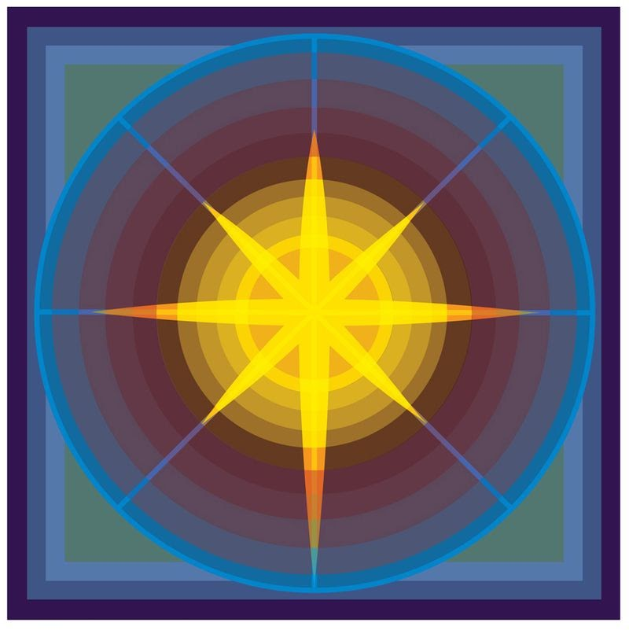
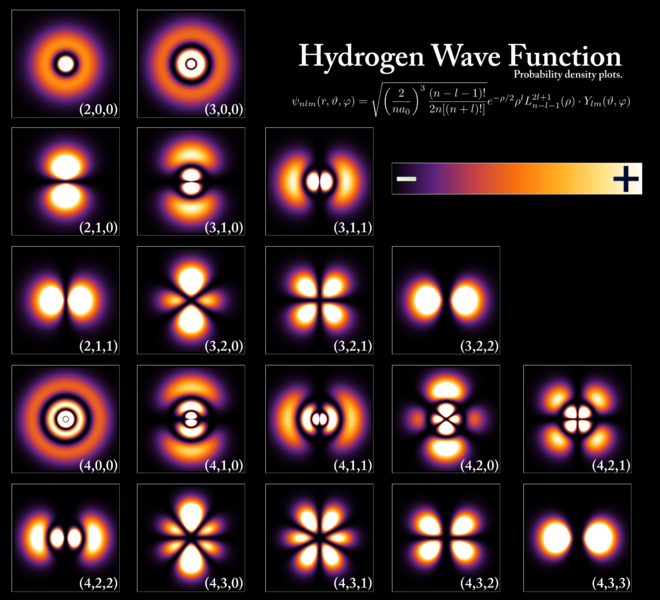
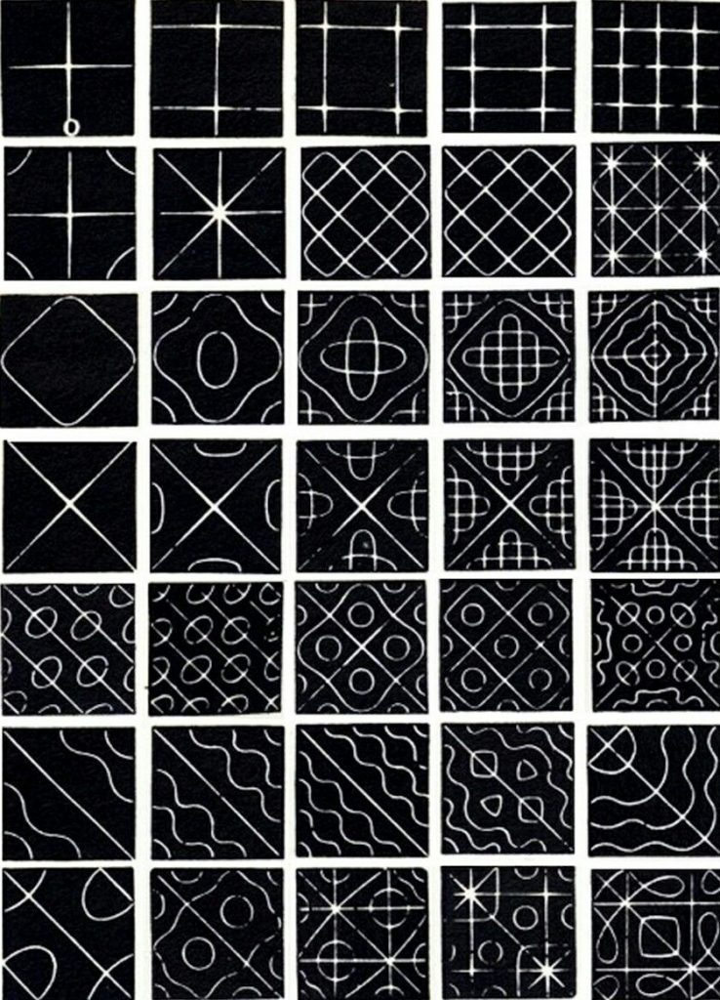
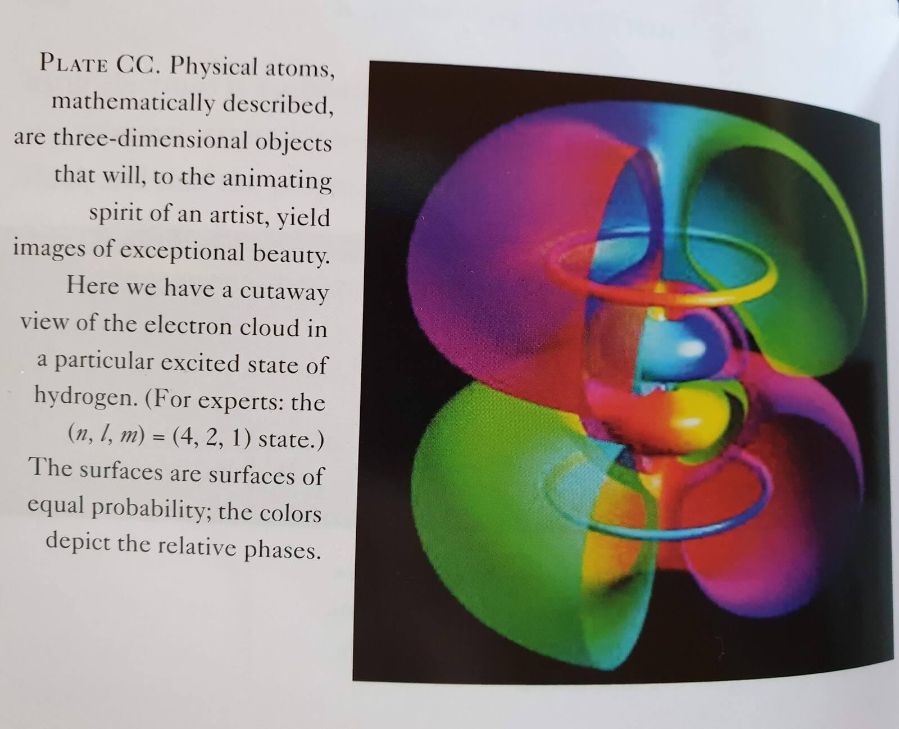
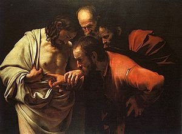
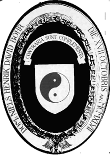

title: A Beautiful Question

description:

# A Beautiful Question

_“Except I shall see in his hands the print of nails,  
and put my finger into the print of the nails,  
and thrust my hand into his side,  
I will not believe.” — the Apostle Thomas_

In 2015, a quiet and reserved man walked into a wood-panelled room in Oxford and gave a presentation. It was on science and perspective and beauty. His name is Frank Wilczek.

He spoke slowly, with long pauses between thoughts as if trying to fit his hard-won truth into less than two hours was a task the difficulty of which few mortals could conceive, let alone complete. And yet, a grand picture emerged between all the slow sentences, as if the ineffable could be spoken of, could be sidled up to using pure symbol and just one question, sculpted from the lumps of rough stone we find strewn along our way through this one wild and precious life.

**Does nature embody beautiful ideas?**

Like all great queries, it is its simplicity that acts as a key capable of unlocking doors you didn’t know were there. Five everyday words – worker words with blue collars, blurted out by just about anybody – can be used to build an artifice, a work of art, that will let you gaze in wonder at the never-ending pattern which plays across our mind each day.

## Numbering the Harmonies

This version of the story starts with Pythagoras, who believed that _All Things Are Number_, because he managed to show how not only shape (in the case of triangles), but also length and tension (in the case of musical strings) are related through number to harmony. The world of mind and the world of matter influence one another, profoundly, and this was already enough – more than 2,000 years ago – to anchor a mystical worldview.

The Greeks, however, were not able to answer the inevitable follow-up to Pythagoras’ discoveries, namely; _why_ do musical notes in ratios of small whole numbers sound beautiful to us humans?

Well, by mapping the inner ear and casting our brain as a pattern prediction engine which experiences accurate forecasts as aesthetically pleasing, we can understand better our perception of sound. We can slip into the spaces between and hear that what we experience as beautiful are simply sounds which are predictable, i.e. those whose frequencies are in ratios of small whole numbers.

## Spiritual Science

Of course – for the ancient Greeks – science and spirituality were not separate fields of study. E. O. Wilson calls this the "Ionian Dream" in his wonderful book "Consilience" - which is alaos well worth reading. In truth, every one of the greatest scientific minds since Pythagoras has entertained this same unificatory dream in some manner, and all of them - without fail - have pointed to some greater pattern behind what their work itself reveals.

Newton is perhaps the best example: he was a deeply devout man, and yet his devotion was not the result of magical thinking: it was a consequence of the method of **Analysis** and **Synthesis** that he put forward most eloquently in _Principia_. It’s worth repeating for emphasis: his devotion was not the _result_ of his spirituality and, like, what he wanted to manifest; it was a _consequence_ of his scientific view of the world.

Through some of the most visionary, critical, and rational thinking ever conducted, Newton was brought to deeper insights about the nature of both himself, and the world of which he was a part.

> “I do not know what I may appear to the world, but to myself I seem to have been only a like a boy playing on the sea-shore, and diverting myself in now and then finding a smoother pebble or a prettier shell than ordinary, whilst the great ocean of truth lay all undiscovered before me.”

> “For so far as we can know by natural Philosophy what is the first Cause; what Power he has over us, and what benefits we receive from him, so far our Duty toward him, as well as that toward one another, will appear to us by the Light of Nature. And no doubt, if the Worship of false Gods had not blinded the Heathen, their moral Philosophy would have gone farther than to the four Cardinal Virtues; and instead of teaching the Transmigration of Souls, and to worship the Sun and Moon, and dead Heroes, they would have taught us to worship our true Author and Benefactor, as their Ancestors did under the Government of Noah and his Sons before they corrupted themselves.”

Newton was not, as so many pop-science writers would have you believe in a lazy turn of phrase, “brought to the edge of rationality” and therefore forced into a faith-based leap into the unknown. He was shown that there is no end to rational thought; no possibility of ever actually reaching the boundary between this and oneness. It is a vital distinction: his is a faith built on the wonder of endless permutations of what is, not a faith built on some supposed bound to rational enquiry and its demand that we believe in the inexplicable.

The same goes for Plato, Euclid, Galileo, Copernicus, Leibniz, Kepler, Maxwell, Faraday, Einstein, Bohr, Pauli, Schrodinger, Heisenberg, Noether, Jeans, Sagan, Feynman, Levin and countless other scientists who are, at heart, some of the deepest and most sincere “believers” in history.

## The Work Will Teach You How To Do It

Kepler in his younger days, imagining the revolution of planets to be ruled by the spacing between five platonic solids, once wrote:

> “God himself was too kind to remain idle, and began to play the game of signatures, signing his likeness into the world; therefore I chance to think that all nature and the graceful sky are symbolized in the art of geometry.”

Of course, the work taught him that his model was wrong; the planets revolve along more complicated ellipses. However, for staying true to observation, Lady Science granted him three laws of planetary motion on top of which Newton would later stand, held still to the ground by the kindness of gravity.

Kepler knew that God was still playing the game of signatures; it was just that the tune was signed far deeper than he had ever dreamed (though that did not make his sky any less graceful, his art any less geometric). Most interestingly, the _Ideal_ world of Platonic solids played a big role in the development of Kepler’s very _Real_ laws.

This would have no doubt pleased Plato, because the primary search for beauty was pretty much his _ding an sig_. He argued that there was a realm of Ideas (or Ideals), which was eternal and unchanging and provided the source of all we can name. Though limiting, it is also the source of our liberation. In a dialogue between Socrates and Glaucon in the _Republic_ where they talk about The Cave, he has Socrates describe liberation as an **active process** of learning and engagement so as to live in awareness of the Ideal behind the Real.

Science, looked at through this historical lense, can best be described as the incremental (con)fusion – based on observation – of the Real with the Ideal. Wilczek sums it up well:

> “Along the inward path, we examine our concepts critically, and try to strip them of the dross of mere appearance, to reach their ideal (i.e. Ideal) meaning. This is the path of philosophy and metaphysics.

>Along the outward path, we engage appearances critically, and try to strip them of complications, to find their hidden essence. This is the way of science and physics [and the] outward path does in fact lead to liberation.”

## Critically Acclaimed

What consecrates itself as common to liberation through either concepts or appearances is a critical approach. However, the kind of criticism used to engage concepts is what we call _constructive_, in that the meaning such criticism attempts to reveal is always-already a human affair. Criticism which engages appearance is called _deconstructive_, because it attempts to reduce down the whole event, via analysis and synthesis, so as to find its “hidden essence”.

Paradoxically, it’s the deconstructionists who can impact the real world reliably. Observing appearances, trying to measure what causes them, and reasoning about the general laws which govern such behaviour leads as surely to technological development as it did to Kepler’s or Newton’s reductionist wonder. On that note, “reductionist” has unfortunately become a dirty word, which seems unfair. Reducing complexity into simpler parts is an incredibly powerful way to think which made its appearance long after myth or narrative in the evolutionary development of human mind. We should not be so quick to discard it.

After discussing the art of perspective drawing, its links to geometry, the discovery of vanishing points on the horizon, and the way such concepts enrich our experience of the Real, as well as our ability to describe it, Wilczek said:

> “When I am alert to these things, my experience is fuller and more vivid. I hope you will find this happens for you too. Through disciplined imagination we transcend the Cave of ignorant sensation.”

Stumbling further out the cave with the hard-won ability to render, and therefore think critically about, different perspectives led inexorably to two very important questions: what does the same picture look like seen from other angles; and what remains the same no matter which perspective you adopt?

## Imagining Real Symmetries

Both questions have fundamentally to do with _symmetry_, what Wilczek described that cold night in Oxford as “Change Without Change.” We know, for instance, that the laws of motion do not change whether you are standing still, or moving at a constant speed. This is called Galilean Translation Symmetry and lies at the heart of Einstein’s Special Relativity.

Of course, Einstein was not the first to make use of symmetries to discipline his imagination so that it might produce something which accurately describes the Real. Maxwell’s equations for light display some of the most profound symmetry anywhere in mathematics, and the pattern they uncover has become the basis for describing both the strong and weak nuclear forces, too.

The really beautiful thing about Change Without Change when we can capture it mathematically was perhaps summed up best by Heinrich Hertz (in a tribute to Maxwell):

> “One cannot escape the feeling that these mathematical formulae have an independent existence and an intelligence of their own, that they are wiser than we are, wiser even than their discoverers, that we get more out of them than was originally put into them.”

You see, Maxwell’s equations describe far more than just visible light. I’m not sure how often you think of it this way, but they reveal how, to Wilczek’s mind,

> “Radio waves are just ‘light’ with a much longer wavelength, and lower frequency, than visible light. In other words, in radio waves the oscillations between electric and magnetic fields take place more gradually in space, and more slowly _in time_. Going from radio toward shorter wavelengths, we meet microwaves, infrared, the visible, ultraviolet, X-rays, and gamma rays. Each of these many forms of ‘light’ has evolved from a purely theoretical construction – in other words, a dream – into a fountain of modern technology. They’re all in Maxwell’s equations.”

Maxwell showed the almost omnipotent power of thinking not just in terms of _perspective_, but also in terms of a conscious search for _symmetry_. Plato, again, would have been proud. In fact, Wilczek – at a half-whisper – continued, “we have learned to work from symmetry toward truth. Instead of using experiments to infer equations, and then finding (to our delight and astonishment) that the equations have a lot of symmetry, we propose equations with enormous symmetry and then check to see whether Nature uses them. It has been an amazingly successful strategy.”

## God’s Aesthetics

It is only here, with a deep and critical understanding of symmetry that we can blur the line between theoretical construction and dream to catch a glimpse of what unifies seeming opposites; for what changes without change. Only now can we begin to speak of some kind of unified vision for both science and spirituality. But, as always, to speak of it would be to ruin it (because my sentences lack deep symmetry). Fittingly, Wilczek noted instead that the “themes of connection, symmetry, and light come together in the art of the _mandala_”, providing this digitally-generated image as proof:

_Birth of the Son of God_ by R. Gopakumar

We must, before turning to the next big developments in critical thought, let Maxwell himself have his say:

> “Happy is the man who can recognize in the work of to-day a connected portion of the work of life and an embodiment of the work of Eternity. The foundations of his confidence are unchangeable, for he has been made a partaker of Infinity. He strenuously works out his daily enterprises because the present is given him for a possession.

> Thus ought man to be an impersonation of the divine process of nature, and to show forth the union of the infinite with the finite, not slighting his temporal existence, remembering that in it only is individual action possible, nor yet shutting out from his view that which is eternal, knowing that Time is a mystery which man cannot endure to contemplate until eternal Truth enlightens it.”

## Back to the Quantum Future

After a long sip of water and some considered silence, Wilczek set out into the quantum surf, which seems at first to herald the New Age, before crashing into a kind of chaotic beauty beyond what your average famous guru can comfortably contemplate.

Basically, the core idea in the quantum world is that everything can be described by its wave function. This sounds cool, but there are three major points to be aware of:

1. Working with wave functions yields probabilities, not definite answers.
2. You don’t get access to the wave function itself, only a peek at processed versions of it.
3. Answering different questions may require processing the wave function in different, and mutually exclusive, ways.

These, in turn, raise conceptual issues. The first raises the issue of **determinism**: is calculating probabilities really the best we can do? The second raises the issue of **many worlds**: what does the full wave function describe when we’re not peeking; a gigantic expansion of reality, or is it just a mind tool, no more real than a dream? The third raises the issue of **complementarity**: which turns out to be both a feature of physical reality and a lesson in wisdom.

The complementarity principle holds that objects have certain pairs of complementary properties which cannot all be observed or measured simultaneously, and was first described by Niels Bohr. Bohr had also done a bunch of work on the “stationary states” of atoms based on their absorption and emission spectra (back to light and connectivity), summing it up neatly with the idea that there was something of the “highest musicality” in how it all fit together.

This is more than a nice way of speaking, because it turns out that the Schrodinger wave equation for an electron in an atom looks very similar to the equation for vibrations in a musical instrument first mentioned in relation to Pythagoras, the length and tension of strings, and the notion that _All Things Are Number_. Natural vibrations in musical instruments produce pleasing sounds; natural vibrations in an electron’s wave function also turn out to mean something simple and appealing for its _probability cloud_ – it doesn’t change at all. Such solutions have the properties Bohr anticipated in his “stationary states”: the electron will persist in any of these patterns indefinitely, and no other patterns have that property.

_“Static states” of a single-electron system, i.e. Hydrogen_

_Harmonic patterns formed using different frequencies on a soundboard. They share deep similarities because the equations governing them have the same pattern or shape._

Of course, as with everything in the quantum world, the rabbit hole goes much deeper. Not only do the building blocks of our universe consist of probabilities with a tendency to travel in ways which match the harmonies of musical instruments; those building blocks exist in vast numbers of identical copies, which neither evolve nor erode, nor, in a stable environment, display any properties that change in time.

Looking back in history, thanks to the finite speed of light, we may see, through their spectra, that the atoms in galaxies a long time ago, and far far away, behave in the same way as the atoms we see on Earth today. If atoms are so stable and resistant to change, how did they arise in the first place?

A lot of the above section is paraphrased from Wilczek’s actual book, but remains as is for the “sake of rhythm”.

## A Paradise Within Thee, Happier Farr

Of course, Maxwell was alert to this conundrum, but only saw it is more evidence of benevolent Creation:

> “Natural causes, as we know, are at work, which tend to modify, if they do not at length destroy, all the dimensions of the earth and the whole solar system. But though in the course of ages catastrophes have occurred and may yet occur in the heavens, though ancient systems may be dissolved and new systems evolved out of their ruins, the molecules out of which these systems are built – the foundation stones of the material universe – remain unbroken and unworn.

> They continue to this day as they were created – perfect in number and measure and weight, and from the ineffaceable characters impressed on them we may learn that those aspirations after accuracy in measurement, truth in statement, and justice in action, which we reckon among our noblest attributes as men, are ours because they are essential constituents of the image of Him who in the beginning created, not only heaven and earth, but the materials of which heaven and earth consist.”

So, we end up in this weird situation where quantum mechanics brings discreteness and fixed, harmonic patterns into the description of continuous objects that obey dynamical equations. Though it’s not obvious, these equations, which could not themselves impose structure, can still do so through focussing the power of other principles.

That is, we can discipline our imaginations with the twin constraining powers of quantum mechanics and cosmology – using cosmology to explain the poverty of energy which ‘encourages’ atoms to seek stable states, and quantum mechanics to show how poverty of energy imposes structure. The challenge, of course, is to describe this all meaningfully to _you_, and after discussing the additional dimensions which would be required to draw the quantum state of an atom with two electrons (i.e. Helium), Wilczek noted that:

> “Worthy images of atoms will share, in their mixture of regularity and variation, the qualities of mandalas. They will offer, too, an awe-inspiring perspective on the assertion at the heart of mystical spirituality: That Art Thou. Because, you know, it is.”

## Beauty At The Core

John Wheeler once summed up Einstein’s General Relativity in the pithy couplet:

> _Matter tells space-time how to curve._

> _Space-time tells matter how to move._

This turned out to be a little too poetic, though. Criticizing the term “Standard Model” for its connotations and opting instead for _Core Theory_, Wilczek is worth quoting at length on this one.

> “In the full Core Theory, including all four forces, matter has four kinds of properties: energy-momentum, electric charge, weak charge, and strong charge. Particles of matter propagate through a more complex space than Wheeler allowed for, which includes electromagnetic, weak, and strong property spaces atop ordinary space. But matter follows, according to the Core, the same yin principle, adapted to this more complex environment:

**_Keep going as straight as you can!_**

> […] The wonder of the Core is that all forces sound like recognizable variations of the same theme. It does not seem to me overly fanciful, and it is certainly pretty, to see in the duality

**_matter || space-time_**

> … an instance of the Chinese complementarity

**_yin || yang”_**

> The whole thing is self-similar across scales, and in all dimensions. This is what makes valid the claim that the weak and strong forces are based on the same exact pattern as Maxwell described for electromagnetic forces; it’s just that they include extra property spaces, like _spin_ and _colour_ in addition to the _charge_ we find in Maxwell’s dreams. Though gravity presents something of a problem, all four can be neatly captured:

> “And so, putting it all together:

 **_Energy-momentum tells space-time how to curve._**  
 **_Space-time tells energy-momentum what straight is (in space-time)._**

> And now comes the Core Theory of electromagnetism:

**_Electric charge tells electromagnetic property space how to curve._**  
**_Electromagnetic property space tells electric charge what straight is (in electromagnetic property space)_**

> And of the weak force:

**_Weak charge tells weak property space how to curve._**  
**_Weak property space tells weak charge what straight is (in weak property space)_**

> And of the strong force:

**_Strong charge tells strong property space how to curve._**  
**_Strong property space tells strong charge what straight is (in strong property space)_**

> **The soul of the Core, from this perspective, is yin-yang, four times over.** 

Take another moment to reflect on this simply beautiful complexity. Wilczek continues to come back to this phrase “what straight is”. Doesn’t that sound just like a synonym for the Middle Way?

## Covariance and Collisions

It’s getting late, and Frank’s talk is showing no signs of slowing up, but stick with me here. This is where it really counts. If we cast the Four Laws as we have above, we are met with a very concrete challenge, namely: how do we get equations for the curvatures of space-time and property spaces? Wilczek is getting increasingly animated about the idea, slipping into hyperbole to see if anyone is still awake:

> “Einstein struggled with this challenge for a full ten years, calling it ‘years of anxious searching in the dark’. He achieved enlightenment by discovering suitable equations for the curvature of space-time, which completed his new theory of gravity, general relativity. He discovered them by demanding that they embody what he called _general covariance_, which is the space-time version of local symmetry.”

With Galilean Translations, whether moving or still, the relative distances do not change, and so the forces remain constant. But if these relative distances change, what happens to the forces? Enter the idea of local symmetries; transformations that vary in both space and time. These are achieved by choosing transformations which only apply to parts of the whole Universe, and require a kind of intellectual yoga:

> “This is the yoga of local symmetry – if we have a metric fluid, _and we make appropriate adjustments in the metric fluid at the same time we make the motions_, then we can keep the relative distances, and force laws, intact!

> […] In this way, we recognise that many different images can represent the same object. But we can get more complex images, still using the same underlying object, if we allow for the presence of a distorting media – curved mirrors, says, or lenses and prisms . . . or, in general, structure that varies from place to place, and bends light. _By allowing for the presence of media, we come to regard a much wider range of images as representing the same object._” (emphasis original)

I know the language is technical, but just sit with me for a while in this old hall, all wood-panelled and well-portraited, and consider the immensity of that idea. Marshall McLuhan may have thought the medium was the message, but he never got anywhere close to the actual maths.

## Why Electrons Actually Are Metaphors

There’s yet more to this rabbit hole, because quantum symmetries are not just about electrons, but also the “zoo” of subatomic particles which make up all our eternal atoms. Unsurprisingly, the trinity of quarks which constitute part of the more popular protons, neutrons and electrons, can exist in many different states of motion, analogous to Bohr’s “stationary states” and “high musicality”. Over to Frank again:

> “These discretely different states have different energies and, therefore, different masses and so appear, operationally, as different particles! In this way, we find that many different particles reflect the same underlying material structure captured in different states of internal motion.”

An electron _is_ a proton; its internal structure is just moving in a slightly different way at the time we measure it. It is the _same object_ seen differently through the medium of electromagnetic fluid.

This shows _why_ electrons are metaphors for a level of reality we can’t directly perceive. Electrons are not **like** other subatomic particles: they **are** other subatomic particles, just in different arrangements of motion, charge, and colour when consciously measured.

Everything is dancing, within and without. Our external movement determines what our internal concept of “life” comes to mean; the internal movement of reality determines how it appears externally at a given moment of lived observation. Each dance is inextricably entwined with the other, born of the same beat, the same benevolence before which Newton and Maxwell and Hertz and so many others bowed.

## Three Wise Souls

In order to understand something like strong property space and the way it curves (so important in beautiful dances), we need to assign it some coordinate system. This is called _charge_ in Quantum Electrodynamics (QED), but we require another property space called _colour_ (for no good reason) to describe the full effect of the strong force. And, unlike photons which respond to electrical charge, but are neutral themselves, _colour gluons interact with one another_.

Which is basically a bitch to work out, but leads to proof of the strong force via the grandiose-sounding **asymptotic freedom** of quarks – i.e. they’re super-sticky at short distances, but the force fades away over larger distances due to the way gluons interact.

Don’t just glide over this, because asymptotic freedom implies a certain simplicity of behaviour at high energies, which brings with it a shower of gifts. The early Universe is comprehensible to us because it was such a high energy kind of party; we can read the message of high-energy collisions in labs today; and different forces come to seem less different at such energies. If that doesn’t get you interested, just imagine asymptotic freedom as the physical equivalent of the Buddhist concept of the “freedom of no escape” and wander on with this meditation.

Describing the coming together of this theory as what is now known as Quantum Chromodynamics (QCD), an animated Wilczek also invokes the spiritual:

> “When David Gross and I, and independently David Politzer, discovered that it _is_possible, it was the sort of moment the Kabbala describes as the “trembling of the Veil of the Temple,” when the shroud that keeps the divine world hidden from our vision stirs.”

Moreover, no longer is this the stirring dance of magic or mysticism, but one somehow even more filled with wonder; with the awe of patterned understanding.

We move past Galileo, Maxwell and Einstein, to find ourselves before Emmy Noether and the maths of time translation symmetry so that we can see how the same laws of physics that apply today applied in the past and will continue on into the future. Noether, and the many other unsung women of science, bring us all the way back to Ecclesiastes in one, smooth movement:

> _What has been is what will be,_  
> _and what has been done is what will be done_  
> _and there is nothing new under the sun._

## Summing Up

Wilczek, taking one last sip of water from a cup that still somehow seems mostly full, clears his throat for the final take. The central point of this whole evening has been, returning to the Saint Thomas quote which started it all off:

Caravaggio’s _Incredulity of Saint Thomas_

> “One sees, first, that Jesus does not resist Thomas’s inquisitive examination, but rather welcomes it. And one sees that Thomas is fascinated and excited to discover that reality conforms to his deepest hopes. Doubting Thomas is a hero, a happy man […] Those whose faith is not passive, but engages reality, will receive a second, more fulfilling blessing in the harmony of belief and experience.

> Blessed are those who believe what they see.”

So, take a look at the coat of arms designed by Niels Bohr, and I’ll leave you with the last six complementarities Wilczek bestowed upon us that night, in the hope it might lead a few weary souls somewhere closer to wisdom:

1. **Reduction and Abundance**: The basic building blocks are few and profoundly simple, defined by high symmetries. The world of objects is infinitely various and complex.
2. **Object and Person**: I am, and you are, a collection of subatomic particles. I am, and you are, a thinking person.
3. **Determined and Free**: I am, and you are, a material object, subject to the laws of physics. I am, and you are, capable of making choices, for which we are responsible.
4. **Transient and Eternal**: Everything is subject to change, or flux. Concepts live outside of time and, because All Things Are Number, can liberate us from it.
5. **Beautiful and Not Beautiful**: The physical world embodies beauty. The physical world is home to suffering
6. **One World, and Many**: The existence of surrounding immensities does not subtract from me, you, or humanity as a whole. It can and does expand our imagination.

Niels Bohr’s coat-of-arms.

>“Do I contradict myself? \
> Very well, then, I contradict myself. \
> I am large, I contain multitudes.” - Whitman

_One story, one road now_ \
_is left: that it is. And on this there are signs_ \
_in plenty that, being, it is ungenerated and indestructible,_ \
_whole, of one kind and unwavering, and complete._ Parmenides

