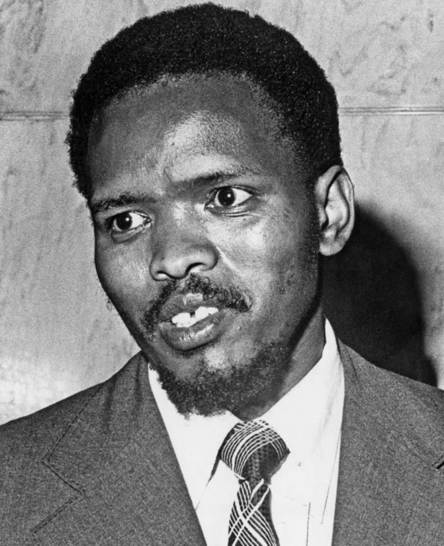

title: Martyr of Hope - A Tribute to Bantu Steve Biko

description: My tribute to one of the true stalwarts of the struggle against apartheid in South Africa, one of the greatest intellects to ever grace the African continent, and one of the finest human beings this world has ever seen.

# Martyr of Hope - A Tribute to Bantu Steve Biko

## Conscious Struggle

I have never been a fan of heroes. Inspiration and the sort of motivation it takes to act in both courteous and selfless ways can only — and must always — come from within. That said, I admit to having one true hero: a man by the name of Bantu Steve Biko. If you haven’t read the collection of this singular human’s thoughts _I Write What I Like_, I recommend stopping here and familiarising yourself with his own words, rather than my interpretation.

Biko lived in a different time — a time when the enemy was well-known and relatively homogeneous. He was surrounded by a community united in a common fight for universal rights and suffrage. Materially and physically, the struggle he found himself in and which he came to lead with such humility and grace, was decidedly more taxing than that facing our generation. Intellectually, though, the lines were far more clear cut.

The enemy is no longer homogeneous — it does not have one colour or one set of laws which can easily be pointed to and vilified. It does not have men like Verwoed and Botha to epitomise what must be fought against, and it does not have stand-out leaders like Mandela, Sobukwe and Biko to unite a large community in the pursuit of a common aim. Ours is an inescapably [grey world](https://breakingsmart.substack.com/p/the-internet-is-one-big-grey-pill).

This does not mean that this generation does not have anything to fight for, or that it lacks the stomach to stand up for the sort of values which have always been worth protecting: responsibility, trust, faith, and love. All it means is that the battle is now exponentially more complex.

However, one need not understand fully the global set of problems we now face in order to act meaningfully. This is where Biko’s philosophy comes into its own, for it was — first and foremost — a positive set of ideas based on **conscious knowledge of the worth of one’s self** as a human being. Though our world is a complex and grey one, and though the fight for a more equitable and just life for all seems interminable and unwinnable, it is from philosophies and politics like Biko’s that we can draw both inspiration and clues to what solutions for our times might look like. There is, after all, nothing new under the sun.

## Why Western Liberalism Sucks

In an essay entitled _Black Souls in White Skins?_, Biko turned his forceful and direct rhetoric on the figure of the white liberal:

> “That curious bunch of nonconformists who explain their participation in negative terms: that bunch of do-gooders that goes under all sorts of names — liberals, leftists, etc […] Nowhere is the arrogance of the liberal ideology demonstrated so well as in their insistence that the problems of the country can only be solved by a bilateral approach involving both black and white […] The integration they talk about is artificial in that is a response to a conscious manoeuvre [by the apartheid government] rather than to the dictates of the inner soul.”

I think this is an important point to note, for there are an increasing number of people who describe the problems of our modern world in precisely such negative and supposedly non-conformist ways, mistaking themselves as having unique and valuable insights. In a later essay, Biko laid the blame for such arrogance and hypocrisy squarely at the feet of Western culture, in which:

> “A visitor to someone’s house is always met with the question ‘What can I do for you?’. This attitude to see people not as themselves but as agents for some particular function is foreign [to Africans]. We are not a suspicious race. We believe in the inherent goodness of man. We enjoy man for himself. We regard our living together not as an unfortunate mishap warranting endless competition among us but as a deliberate act of God to make us a community of brothers and sisters jointly involved in the quest for composite answers to the varied problems of life.”

Having identified the perpetrators of the more subtle and insidious kinds of evil that average men and women are prone to give themselves over to, Biko presents what he believed to be a uniquely Black, African solution:

> “In rejecting Western values, therefore, we are rejecting those things that are not only foreign to us but that seek to destroy the most cherished of our beliefs — that the cornerstone of society is man himself — not just his welfare, not his material well-being but just man himself with all his ramifications. We reject the power-based society of the Westerner that seems to be ever concerned with perfecting their technological know-how while losing out on their spiritual dimension. We believe that in the long run the special contribution to the world by Africa will be in this field of human relationship. The great powers of the world may have done wonders in giving the world a military and industrial look, but the great gift still has to come from Africa — giving the world a more human face.”

## Use Your Heart, Free Your Mind

For thinking and speaking like this, Bantu Steve Biko wins my undying love. His words have a physical effect on me, starting as goosebumps in my milky-white skin, surging through my stomach, and stopping in my lungs, where breath can no longer pass, so caught is it in the implications of his words. It was Biko's realisation — drawn from a long history of African thought collected under the umbrella term of[ ‘ubuntu’](https://en.wikipedia.org/wiki/Ubuntu_%28philosophy%29) — that community was the place from which one drew both true power and comprehension which singled him out as such a brilliant and persuasive individual.

It was his realisation that there is nothing more worthwhile or noble than fighting to give society a more human face, and that such a ‘fight’ will always, in fact, take on the nature of a gift given by what he termed ‘selfless revolutionaries’ that marks him forever as my only true hero.

It was, indeed, Biko who first argued that:

> “At the heart of such [communal, human-centric] thinking is the realisation by blacks that the most potent weapon in the hands of the oppressor is the mind of the oppressed.”

This is true in any generation — no matter how complex the world they face. And it remains as necessary today to free your mind from both the narrow, capitalistic narrative that what you make and who you know are all that matters; as well as the equally simplistic and misleading narratives of transcendence, abundance, thriving, or whatever other buzzword you care to pick as you scroll down the omnipresent newsfeed.

We live in dangerously interesting times. There are no simple choices left, but this should not prevent an honest reckoning with what Biko called ‘the dictates of the inner soul’ for it is there — as it always has been — that we are most likely to stumble upon truth.

Finally, in a letter to a priest, Biko summed up his thoughts by writing, clearly and elegantly:

> “In my view the truth lies in my ability to incorporate my vertical relationship with God into my horizontal relationships with my fellow men; in my ability to pursue my ultimate purpose on earth which is to do good.”

If only a few more humans in our age were gifted with such simple genius.

## Singular Love

Ultimately, I don’t think that living in a grey world is a terrible burden. The complexity we face is far greater than it has ever been, but this also means that the opportunities we are presented with are more varied and accessible.

As for the almost-interminably interwoven and complex nature of power that we face — and to which we must always endeavour to speak our truth — I can only paraphrase the two most formative movies of my life: on romantic evenings of self I go salsa dancing with my own confusion, for a revolution without dancing is a revolution not worth having.

Finally, Biko - with Mandela - is the man most representative of the political singularity that took place in South Africa at the end of the 20th Century. In this context, I use “singularity” to point at a being or action so extraordinary in its scope or vision that they echo throughout history and change indelibly the nature of the lives or actions that follow. Simply put, Biko is proof that singularities happen, and have always happened, lodged as they are in the breasts of human beings who act with the righteous might of selfless revolutionaries.

Bantu Steve Biko’s life is proof that there exists in this world a kind of love that does not make any proclamations of its worth, nor ask anything of its beloved. A kind of love that is fragile and vulnerable enough to die in the back of a police van somewhere between Port Elizabeth and Pretoria. A kind of love strong enough to resurrect itself in the hearts and minds of people for generations unending. A kind of love that is at once unique, finite, and deeply personal, and simultaneously universal. A kind of love that is eternal. His life is proof of the ordinary nature of miracles and what I once heard called “the tender gravity of kindness” — a cosmic force powered by the simple conviction of true belief.