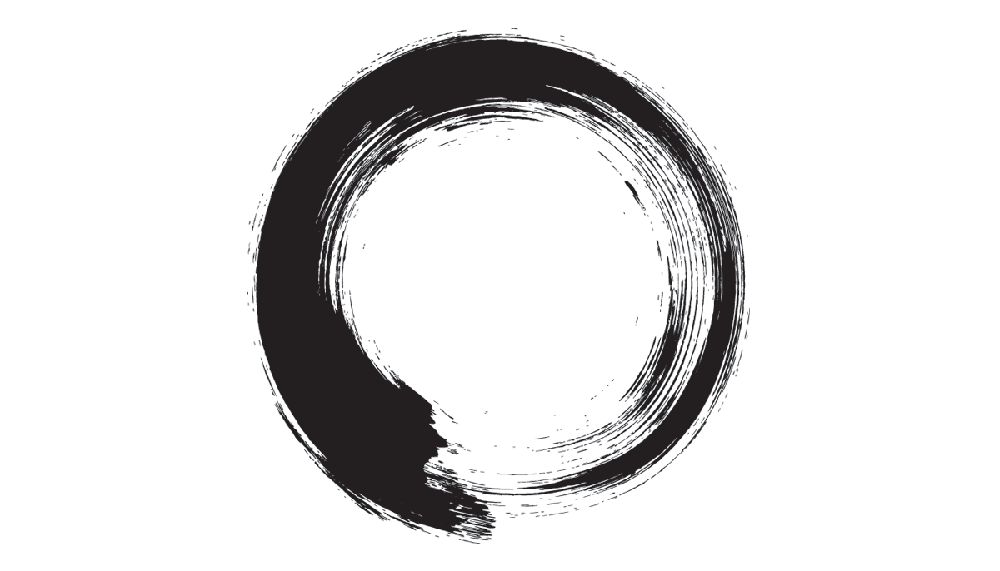

# All The Colourful People

The half moon is rising late at the moment. It only peaks above the horizon and casts a rippling road of yellow light over the sea an hour or two before midnight, which means the stars here on the Wild Coast are something to behold on clear evenings. The Milky Way runs across the whole sky like an old mineral line across this third rock, revealing a way to orient yourself that all our city lights have lost in the haste and hurry of modern life.

Life is everywhere. It settles in every tense and all the spaces in the sentences we make up.

Two nights ago, I took a new friend down to the beach after sunset and before _N/aueema_, our moon, made her late appearance. We went down to the sea to walk on sky. To wander between the stars cast perfectly in reverse on this first mirror, shining in the millimetre of silk left floating above the saturated sands as the tide retreats, as if all the waters in the world were needed somewhere else to raise the white knight, keep her circling our home, before they wash back in and herald another golden dawn.

We wandered through the past, pointing out all the constellations we could remember, telling old stories about Orion and Sirius and Andromeda and all the stars between, so thick you can barely see any background. And then we sat on the shore, the sea itself our incense, and listened to an old Tibetan bowl sing of emptiness and submission and what it means to be saved by grace.

In such a magical place, with myth so palpable you can feel it without reading any words, still this new friend struggled with meditation. Even here, covered in the African dark, it can be difficult to empty your mind. But “the point” of meditation is not to get good at sitting around, thinking about nothing. If anything, it is to turn the living of life into a meditation: every act and thought achieved in a reflective and care-full way. Just as “the point” of shamanism or sangomahood is not to learn how to hold ceremonies, but rather to turn living itself into a ceremony: every act and thought ceremonial, done with a sense of sacrifice and stepping aside to let what is sing its singular song.

We might even say that “the point” of art is not to _produce_ a masterwork, but rather to turn your own life into such a masterwork through creative attention to the kind of details others miss. This is a yoga: to turn the living of life into one, continuous piece of art made up of discrete and jewell-like moments, separate in time and space, but connected by the kind of beauty that will save our world.

## Massaging the Medium

One of the most powerful media we have for achieving such a lofty aim is simply _conversation_. If you can listen to others deeply enough to learn how they love, which is to say to learn how they see the world the way it is and somehow agree to go on living, you can enter into a sincere dialogue where all is performance and nothing is kept secret.

By asking good questions, rather than just listening to respond, and by letting the “third space” between us lead any collection of words we might utter or encounter closer to the truth as it is in that moment, we can colour our lives with all the strangest and most awesome shades. Knowing the depth and wealth of colour that awaits us in the shadows is yet another kind of yoga.

Which leads me to two fantastic conversations I’ve had recently – one with an engineer, the other with an artist – about colourful people. It seemed, in both talks, that humanity can be roughly divided into “colourful” and “grey” people. Colourful people are those you meet who seem always to have an interesting question or answer for you, who bleed light despite themselves and come to conversations armed with pebbles carved down from what were once mountains and leave them humbly at your doorstep for some time later when you’re finally ready to notice them.

Grey people are those you meet who seem always to have a problem, who respond only insofar as it relates to themselves and their own suffering. In the artist’s rendering, they are the “adults” of this world, so crusted up with old and narrow ways of seeing that they must be broken down again before they can realise what it’s really all about.

## Born and Made

However, while I think full human being may well be an achievement we must work to reclaim after growing out of childhood, I have this sense that colour is a birthright.

We find ourselves somewhere mysterious between the born and the made, and I cannot help but believe that everyone is at least born with the ability to be colourful, even if making ourselves into a human being who can respond appropriately always to our world and the others with whom we share it is something of which many fall short.

Moreover, the point is not really to “break others down” so that they can see again what simply is. There is, firstly, a notion of hubris in this not suited to fine art. Who are you? Why is your way of seeing any better than any other? Secondly, looking at the world this way gets tiring quickly.

If you think constantly that you are responsible for shattering the glass lens of others’ illusions, that you must always be “good” despite living in a world full of suffering, then it tends to get pretty overwhelming pretty fast. The cognitive dissonance is immense. Again, who are you to be good? Why should what is good to you also be good for others?

> _You do not have to be good._  
> _You do not have to walk on your knees_  
> _for a hundred miles through the desert repenting._  
> _You only have to let the soft animal of your body_  
> _love what it loves._  
> _Tell me about despair, yours, and I will tell you mine._  
> _Meanwhile the world goes on._  
> _— Mary Oliver_

These lenses through which we look at the world – the ones which become encrusted as we move away from childhood and make ourselves, with the help of a largely harsh and indifferent world, into adults – are an inevitability. Much like the self or the ego, any introspective journey will show them up as ultimately illusory and responsible for a whole bunch of distortion, but it will also eventually bring you back to realising just how important such wilful distortions of the world are for practical action: we cannot survive the immensity of the ordinary without a motivating ego.

## Converse With Care

The goal of artistic conversation is not to shatter others’ lenses, nor to show up your own as somehow clearer. If anything, it is to realise through paying attention that everybody is born colourful and sometimes all we need to do is stand next to another human and help them turn their inevitable lens just the slightest bit, so that instead of letting the light pass through grey and unnoticed, we might bend by a tiny amount and reveal the whole rainbow spectrum.

Colour is our birthright. Turning that smallest bit to reflect it, perhaps the only thing worth achieving.

This is, after all, where we get the word “parable” from: translated literally as “to place beside”. Though all art – including life – can only ever be a representation, by placing ourselves beside others and loving them for whatever they have learnt from their unique experience, we can turn our own being into a story which signifies something greater; something that cannot quite be got at through conventional language.

Then, of course, comes the near-completion of the [enso](https://en.wikipedia.org/wiki/Ens%C5%8D) that brings us back to [will and representation](https://en.wikipedia.org/wiki/The_World_as_Will_and_Representation), and how these operate as an effective means of choosing the part(s) of the spectrum which most draw your eye; how they allow you to live in your colour and make it a part of the breath your draw each new day.

Or you can try skipping across the whole rainbow gaily, lost in wonder that we could have forgotten – even for a moment – that there are places in this world where you can walk on stars and sing in tandem with sea and the otherwise perfect silence.
