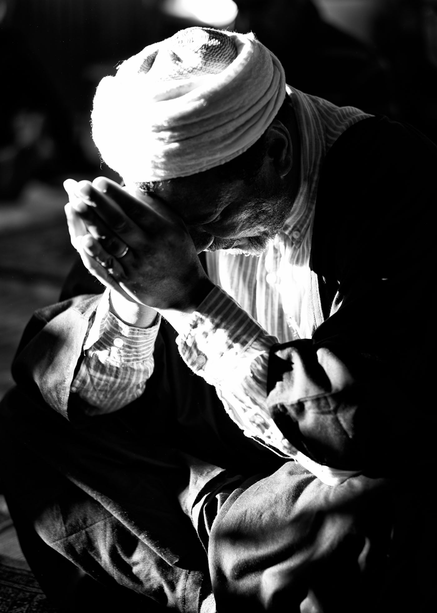
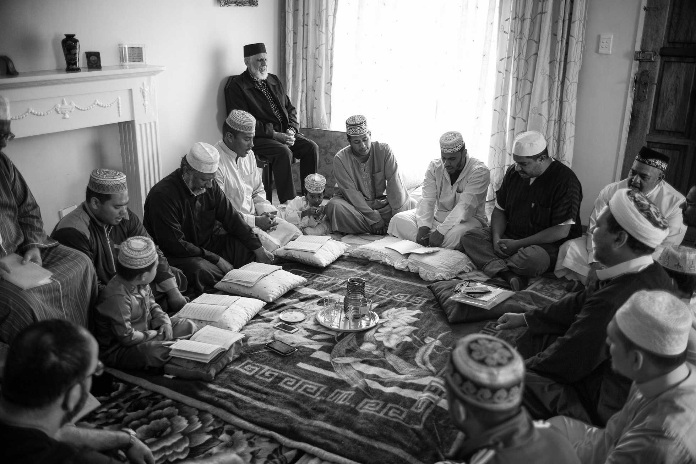

title: Overview - Essays

description: An overview of all the essays written by Andy Tudhope

# Essays

**Living: The Essay**

Before reaching spiritual maturity Sufi literature can encourage fantasy or act as a placebo with uncertain outcome. In the material realm more is sought, in the spiritual realm the reverse is true.

The accomplished Master will help the seeker to focus on his goal and the devotee to give up attachment to everything.

[Read More](./living-essay)

**Viewing Time**

One’s attachments, phobias and habits are as secure as the wisp of thought that repeatedly brings them about. The ultimate refuge is with Allah.

[Read More](./)

