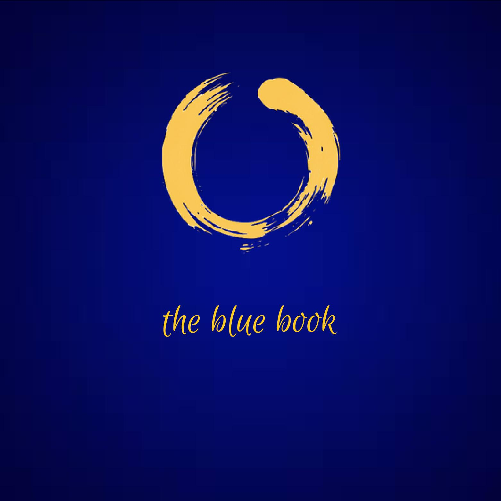

# Essays

**_Animal's People_ - Embodying What You Read**

A long essay on one of the most important novels ever written, exploring the limits of empathy, the failings of liberalism, and what it really means to read responsibly.

What is really toxic: the world as it is, or our attempt to contain it within our limited interpretive frameworks?

[Read More](./animals-people)

**Martyr of Hope - A Tribute to Bantu Steve Biko**

My tribute to one of the true stalwarts of the struggle against apartheid in South Africa, one of the greatest intellects to ever grace the African continent, and one of the finest human beings this world has ever seen.

[Read More](./bantu-steve-biko)

**The Final Belt**

A true story about a Two Row Wampum Council meeting in which the Black Wampum Belt was shown for the first time in this Great Year (~25 772 years), and what it meant to those who attended.

[Read More](./the-final-belt)

**Viewing Time**

By drawing a clear distinction between reality, and what we know about reality, this essay makes an argument for how to think about, describe and - ultimately - experience time differently. Perhaps even stop it altogether.

[Read More](./viewing-time)

**Blue Devotion**

This essay summarises the ideas behind, and the work done to achieve, The Blue Book. What is this digital artifact really inspired by, where did it come from, and what might it be used for going forward?

[Read More](./blue-devotion)

**Living: The Essay**

“There is another reality, the genuine one, which we lose sight of. This other reality is always sending us hints which, without art, we can’t receive." — Saul Bellow

I have read many books in my life, searching for this ‘other reality’ scribbled out by various authors. I sought the secret everywhere and did the most silly things in my attempt to discover a way in. Until one day I stopped.

[Read More](./living-essay)

**Finding Blue Infinity**

How to build your own book using an infinite library and non-fungible tokens that are responsible for what gets displayed, and where people are sent in amongst all these endless possibilities. 

[Read More](./finding-blue-infinity)

**A Beautiful Question**

One sees that Thomas is fascinated and excited to discover that reality conforms to his deepest hopes. Doubting Thomas is a hero, a happy man […] Those whose faith is not passive, but engages reality, will receive a second, more fulfilling blessing in the harmony of belief and experience.

A deep and wide walk, led by Frank Wilczek, through the wonderful world of scientific symmeteries and Quantum Chromo-Dynamics.

[Read More](./a-beautiful-question)

**Governing Gracefully**

Governance mechanisms that distribute funds _by virtue of how they work_ will trump those that attempt to distribute funds as an outcome of their work.

[Read More](./governing-gracefully)

**Language In The Ether**

What does it mean to have an expressive programming language, which compiles down to binary and runs on a shared "world computer"? What kinds of metaphors can we use to engineer valuable meaning in the post-modern world?

[Read More](./language-in-the-ether)

**All The Colourful People**

An essay which discusses colourful and grey people, and how to stand beside one another in such a way that we can help the other turn to face the light in such a way that they refract it to produce the full rainbow spectrum.

[Read More](./colourful-people)

**Reading As Layered Ritual**

An exposition of Stanley Kunitz's famous poem, "The Layers" which goes into the art of deciphering, the role of "you" as a reader, and the many layers of self and text which must be worked through and seen just as they are if they are ever to be transcended.

[Read More](./reading-as-layered-ritual)

**Rough Consensus and Running Code**

A summary of the famous IETF working paper of the same title, updated for a slightly more modern internet as we are experiencing it nearly 30 years later.

<a href="https://kernel.community/en/learn/module-4/consensus/" target="blank" rel="noopener noreferrer">Read More</a>

