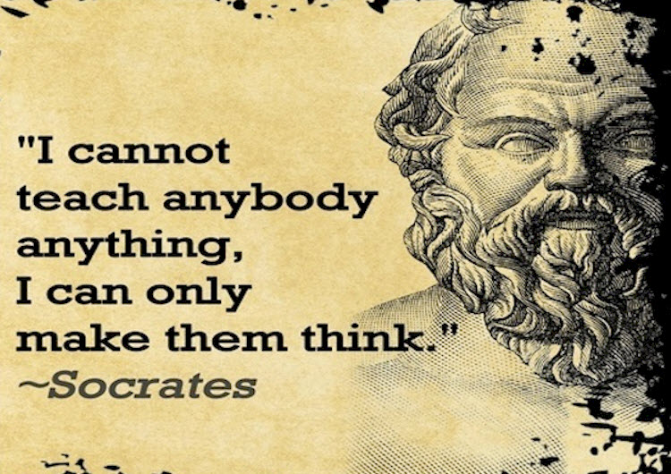

title: Rough Consensus and Running Code

description: A summary of the famous IETF working paper of the same title, updated for a slightly more modern internet as it exists 30 years later.

# Rough Consensus and Running Code

_"He who defends with love will be secure."_  
_-- Lao Tzu_ 

 

[This historical IETF document](https://tools.ietf.org/html/rfc7282) repeats - again and again - the simple maxim that **engineering is really about tradeoffs**. As such, we should develop clearer ways of thinking about how we make decisions. The overarching goal is to avoid the dangers of "majority rule" and get to rough consensus decisions which promote the best technical outcomes.

Rough consensus is therefore a sort of "exception processing", meant to deal with cases where the person objecting still feels strongly that their objection is valid and must be accommodated. Balloting or otherwise looking at percentages cannot "determine" consensus in such cases. 

One of the strengths of this model is that minority views are addressed, **with justification**. Simply having a large majority of people agreeing to dismiss an objection is not enough to claim there is rough consensus; the group must have honestly considered the objection and addressed fully all technical issues.

Pete Resnick, the author, quotes a presentation from Dave Clark in order to establish his argument. In that [same presentation](https://www.ietf.org/proceedings/24.pdf) (see pg 551), Clark outlined what the IETF was good and bad at in 1992:

**What are we good at?**  

1. ̄Responding to short term reality.   
2. Building stuff that works.  
3. Calling bad stuff bad.  

**What are we bad at?**  

1. Growing our processes to match our size.     
2. Setting long-term direction.  

It all sounds awfully familiar nearly 30 years later. The below only summarises how the IETF addressed this, which was mostly in the negative: i.e. consider issues first rather than agreements; address them but don’t accommodate them; consensus is a tool and **not** a destination etc. I think we have at least come to understand that the scarce resource of human attention, consciously employed, can be used to shape long-term direction in community-based, decentralised, and open-source projects. However, I’ll leave this for another time. Alternatively, read [my summary of SwarmWise](https://docs.google.com/document/d/12Qema_8hPWuzDhqb8Tim66QZleVFcMXkVWICyH4nIT8/edit?usp=sharing); this idea is outlined well there.

## 1. Lack of disagreement is more important than agreement

1. _Determining_ consensus and _coming to_ consensus are different things than **having** consensus. In determining consensus, the key is to separate those choices that are simply unappealing from those that are truly problematic.  

2. Consensus is when everyone is sufficiently satisfied with the chosen solution, such that they no longer have specific objections to it.  

3. Closure is much more likely to be achieved quickly by asking for, and trying to accommodate, the objections rather than asking for agreement.  

### 2. The two meanings of "compromise"

1. Among **engineering choices**, compromises are expected and essential. We always want to be weighing tradeoffs and collectively choosing the set that best meets the full set of requirements.   

2. Among **people**, far less so. Such compromises occur when one group has given up trying to appease the others. Conceding when there is an outstanding technical objection is not coming to consensus. Even worse is "horse-trading": "I object to your proposal for such-and-so reasons. You object to my proposal for this-and-that reason. Neither of us agree. If you stop objecting to my proposal, I'll stop objecting to your proposal and we'll put them both in."  

## 3. Rough consensus = issues addressed, not necessarily accommodated  

1. "That's not my favorite solution, but I can live with it; I'm satisfied that we've made a reasonable choice" - this is **not** rough consensus. It’s only rough when an unsatisfied person still has an open issue, but the group has truly answered the objection at a technical level.

2. This relies heavily on the good judgement of the **consensus caller**, or chair. Finding “rough consensus” means that not only has the working group taken the objection seriously, but that it has fully examined the ramifications of not making a change to accommodate it, and that the outcome does not constitute a failure to meet the technical requirements of the work.

3. What **can't happen** is that the chair bases their decision solely on hearing a large number of voices simply saying, "The objection isn't valid."  That would simply be to take a vote. **A valid justification needs to be made**.

## 4. Humming, not Voting  

1. We don't vote because we can't vote. The IETF is not a membership organization, it's nearly impossible to figure out who would get a vote for any given question. There are only “participants”, not “members”. 

2. One reason for humming is pragmatic: to **find a starting place** for the conversation. A hum can indicate that there were less objections to "foo" than to "bar" at the beginning of the discussion, so starting with the objections to "foo" might shorten the discussion.

3. Another is to take the temperature of the room.  A smaller bunch of loud hums for choice A and a larger number of non-committal hums for choice B might indicate that some people believe that there are serious problems with choice B, albeit the more popular by sheer number of people.  

4. There is deep symbolism here: a show of hands might leave the impression that the number of people matters in some formal way. It doesn’t - see below.  

5. The formulation and order of questions asked during a hum can have huge effects on the outcome: Asking, "Who supports going forward with this proposal?", and asking it first, can cause more people to hum in the affirmative than would for differently formulated questions, or asking the same question after some more "negatively" framed questions. Any sort of polling, whether hums or even a show of hands, must be done with caution and should almost always be used to prompt discussion and questions, **not to conclude the matter**.

## 5. Consensus is the Path, not the Destination

1. **Consensus is a tool** to ensure we get to the best technical outcomes.

2. Experience has shown us that traditional voting leads to gaming of the system, "compromises" of the wrong sort as described earlier, important minority views being ignored, and, in the end, worse technical outcomes.

3. Again, you **cannot** confirm that there is consensus by counting people, it must be about the outstanding issues and whether they have been addressed.

### 6. One hundred people for and five people against might not be rough consensus  

1. If there is a minority of folks who have a valid technical objection, that objection must be dealt with before consensus can be declared. This rules out vote stuffing.

2. It's the existence of the unaddressed open issue, not the number of people, which is determinative in judging consensus.  As discussed earlier, you can have rough consensus with issues that have been purposely dismissed, but not ones that have been ignored.

### 7. Five people for and one hundred people against might still be rough consensus

1. This one is the real mind-bender for most people, and certainly the most controversial. It generally occurs in the case of small, active working groups where an objector recruits many otherwise silent participants to their cause.

2. The principle is still the same: If the objection has been addressed, and the new voices are not giving informed responses to that point, it can still justifiably be called rough consensus.  

3. Sometimes, a show of hands can be useful; sometimes, it can be damaging and result in suboptimal decisions.  Sometimes, using a device like a "hum" can avoid those pitfalls; sometimes, it is just a poorly disguised vote. The objective nevertheless remains to protect against simple “majority rule” and get to the best technical outcomes.
