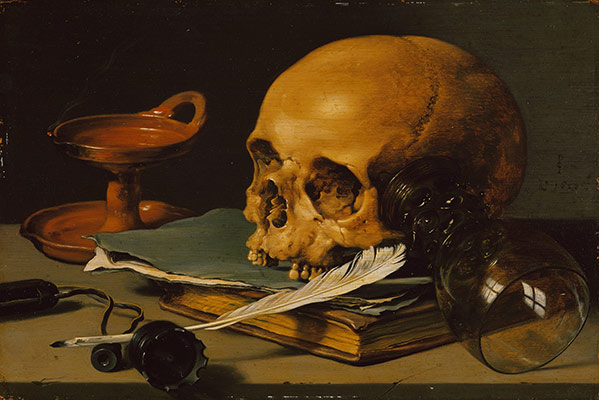

title: Poetry

description: Overview of Poetry Section

# Poetry

> “Whoever has sought Me has found Me. Whoever has found Me has come to know Me. Whoever has known Me has loved Me. Whoever has loved Me I have slain. Whomever I have slain the payment of the blood money is on Me, and I will Myself be the payment for the blood money that I owe.” — Hadith Qudsi

Below, you'll find some random poems that somehow did not make it into my four-part digital harmony. For real insight into this favourite past-time of mine, please go directly to <a href="https://thebluebook.co.za" target="_blank">The Blue Book</a>, its <a href="https://living.thebluebook.co.za" target="_blank">living</a> companion, the one which <a href="https://dyeing.thebluebook.co.za" target="_blank">dyed</a>, or the <a href="https://thebluebook.co.za" target="_blank">unification</a> of all three.

**Maryam**

[Read It](./maryam)

**Steel Jasmine**

[Read It](./steel-jasmine)

**Spring Free**

[Read It](./spring-free)

**Falcon Heavy**

[Read It](./falcon-heavy)

**Still Life**

[Read It](./still-life)

**Basirah**

[Read It](./basirah)

