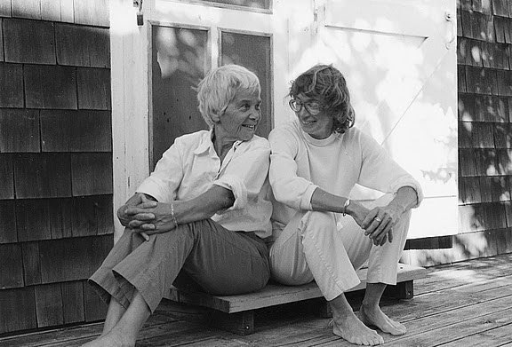

title: Maryam

description: A eulogy for Mary Oliver

# Maryam

She left yesterday, my _anam cara_,  
those strange sounds signifying  
something before words,  
some resonating field who formed  
my soul friend, somehow  
more astonished than me,  
who paid attention, simply,  
and told about it in ways  
us wanderers whisper,  
deep in dreams of wild geese  
and the willows who wait  
(still) by the side of small streams  
and sing of passing things,  
a few wooden words woven together  
with a silence that lets  
another voice speak,  
that keeps enough room  
in our heart to hear  
what is.  
  
Go well, lover, lost  
in endless questions;  
a journey to the grail  
and some ancient quest  
to uncover what lies beneath  
swans and grasshoppers,  
and how to kneel in green blades  
where everything dies at last  
and too soon;  
where we must answer this wind  
which ruffles the hair of graves  
and wills us to be dazzled  
by dying light,  
maybe even float a little  
above this difficult world.  
  
Words a small sacrifice  
to our imagination,  
harsh and exciting,  
with no need for goodness  
or repentance;  
just a soft rhythm rolling  
around an empty basket,  
filled with compassion  
and all our careful watching.  

