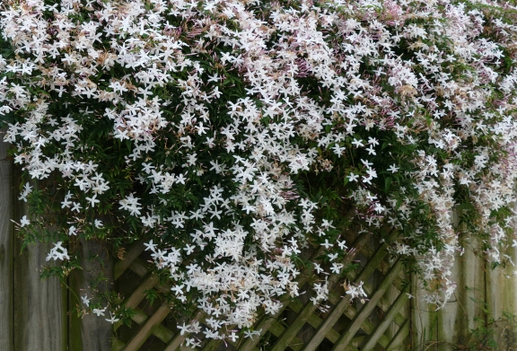

title: Steel Jasmine

description:

# Steel Jasmine

This fool walks the edge of worlds,  
wandering through endless boundaries  
beneath starry nights which wrap  
him in a timeless cloak, a man lost  
in the utter beauty of it all.  
  
The crushing, terrifying beauty  
that sometimes crawls up  
soft and inviting,  
sometimes grabs and chokes  
in its steel grasp:  
unexpected, unable to breathe,  
bound and chained and chanting.
  
Everywhere the scent of an old flower,  
crushed into the folds of me  
a long time ago, next to a river  
as the village drums played and a wind  
wound its way into my head,  
whispering stories of hungry roads,  
strung across with Anansi’s webs,  
forged somehow in the flowing night  
by floating through space, suspended  
on a single thread of silk,  
singing too the singular truth  
of star jasmine, fragrance as notes  
that can be felt and all the world  
one thing, rightly seen.  

