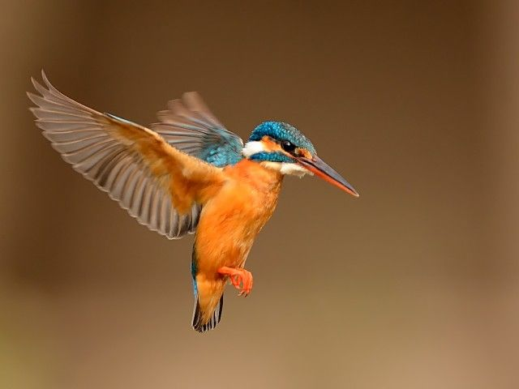

title: Prose

description: A collection of all the prose I have written over the years.

# Collected Prose

> “Beauty in art: the suddenly-kindled light of the the never-before-said. This light that radiates from the great novels time can never dim, for human existence is perpetually being forgotten by man, and thus the novelists’ discoveries, however old they may be, will never cease to astonish us.”  
>  
> **— Milan Kundera**

I don't generally write prose, feeling that it is not very well suited to people's attention span in digital media, but sometimes I treat myself and detail my thoughts and experience in a slightly more concrete and long-winded fashion than poetry allows for.

> “He wonders what makes the light so strong. Why can he just see white when he looks into it? Where are the greens and reds that dance across his clothes? He looks at his body — it is drenched in color. His arms, his hands, his legs, are luminous, brilliant. He feels the brilliance being absorbed through his skin, saturating his flesh, flowing through his blood all the way to his fingertips. He starts radiating brilliance himself. Brilliance that illuminates each row of empty seats, brilliance that paints each wall a blinding white, brilliance that turns the curtains into sheets of light. As Vishnu watches, the entire theater becomes incandescent. He looks down at himself, but he can no longer tell where the light ends and his body begins.”  
>  
> **— Manil Suri**

**Celebrate**

_And eyes beholding radiance._  
_And the gnats’ flickering dance._  
_And the seas’ expanse._  
_And death, and chance._  

[Read More](./celebrate)

**Rivers of You**

A short piece which plays with the pronouns "I" and "you", and floats somewhere between on the beat of broken sentences and fragrant suggestion.  

[Read More](./rivers-of-you)

**Father Time**

Some rare biographical writing about my experiences in Englad while studying, and all of the many ways in which is is possible to traverse time while living through it.  

[Read More](./father-time)

**There's You In Everything I Do**

Consider again that every "I" who speaks implies a "you" who is listening, in whose response that "I" will become "you". This movement between pronouns is the mark of any dialogue, and constitutes "our" sense of self. Here is a further demonstration of this primary phenomenon.  

[Read More](./you-in-everything-i-do)

