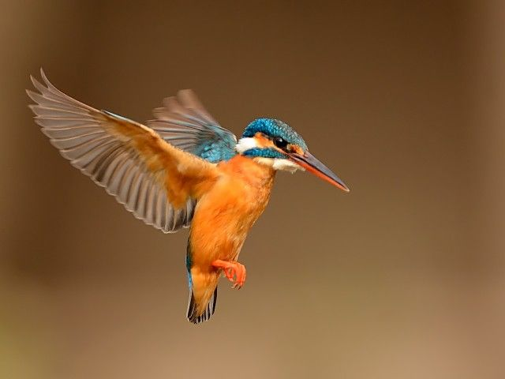

title: There's You In Everything I Do

description: A short prose piece which weaves together Mary Oliver, Alan Watts, some zen koans, and my own experiences and dreams.

# There's You In everything I Do

I’ve walked through this red dream before. Have forgotten, in the same way, how to hear the music playing in the background, how to look up and see the brilliance hidden all around. I’ve wondered, again and again, how it is that we find each other, how two people ever meet. If we ever even do…

In between, these half-forged memories of a pygmy kingfisher hovering in a bank of reeds while we glided by in stunned silence. Amazed that bodies can be this way, can be so much a part of the river, can melt on sandbanks in the African sun: surrounded by [silience](https://www.youtube.com/watch?v=i_DZHALK2yE), and silence, and all the other sacred words found with little turns of the alphabet around quiet corners no-one ever bothered to explore.

I told you once of lucid torture and utter freedom – of the faded letters left stuck to your shoulder that later you picked at like some kind of soiled hieroglyphs and how you would have loved forever anyone who could have deciphered them. How breathless we were after it all. How you longed for anyone who could have read that inch of toilet paper on which a prisoner scribbled the secrets of her life, of life itself, shoving it in a crack in the torn hope that some soul, as lost as her, might find it again one day.

You know the story now of how, years later, I stumbled across it in an old passage about fragrant song. How it brought me to my knees, the sky low and grey, the rain pouring down. The night itself complete. And reading it, how I got this strange feeling, just then, that everybody’s name is “I”, and that there will always be eyes in the world. Every eye – in a sense – the same I; the master just a pupil in the eye of the world. We all might be anyone else; and there is no escape. It goes on and and on and on forever. So long as there is consciousness anywhere, there am I.

You, then, look out through all eyes, and is this not (finally) the great secret of compassion?

Can you see now why I looked out from that window which would not open more than a crack and played the Celebration Concert on full volume as all the walls were torn down? Watch me walk my love on a beach far away, singing a stupid song, but singing it together. Look at how that makes all the difference.

Here, we lie on the night green side of it, crying our hearts to the floating stars; knowing the underside of skin to be blue dream itself. And here we understand, in stillness, what it might be like to die – to have walked a long road, full of fallen trees and shadow, the wind howling and everyone around you calling out in terror; and deeper still, to that new voice which speaks of wild geese and melting into the only sound you can now recognise. A voice you know as your own, echoing across these vast desert plains and white fire all around as the hero comes, finally, to save herself.

The sky is blue forever.

Breathe, and come again to peace, for who can know the dancer from the dance? We have walked so far together now, old friend, through so many layers. Through so many lies and lives and love and loss. Tell me, do you see what I see? Do you see me?

Even when I’m beaten to within an inch of bloody life, can’t you tell it’s just another way to ask if we have learnt to love it all completely yet? I don’t care what you believe, all I ask is how much of the infinite does your belief allow us to see?

